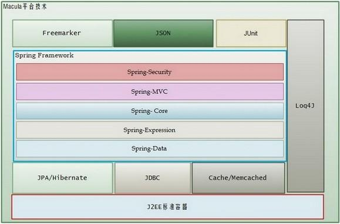

# 概述

## 技术架构

Macula开发平台是选用一些广泛使用的、优秀的开源框架作为底层实现，并在这些开源框架上整合调整，以最佳实践的方式构建而来的开发平台。所以熟悉和了解所使用的开源框架，是了解和深入Macula开发平台的前提。

Macula开发平台使用的开源技术有：

*   **Spring Framework**：Spring作为优秀的开源框架，也是Macula平台的主线框架,Macula平台的开发均围绕SpringFramework，并在此基础上引入相应的扩展。
*   **JPA Standard / Hibernate**：选用J2EE标准的JPA规范作为数据存取层的实现，Hibernate作为优秀的JPA实现，在Macula平台中，默认使用Hibernate的JPA实现。
*   **Freemarker**：Freemarker作为展示模版的优秀框架，可通过Macro宏、标签等 多种方式代理JSP，除了Freemarker的性能与JSP不相上下外，Freemarker模板可根据多种方式载入，如类路径、Web路径、文件路径等，这样Freemarker模版可以方便的打包到业务插件JAR中。
*   **JSON**：当前数据的传输标准，除XML外，JSON以其轻巧、易读以及传输量小的优点，在Macula平台中，在Ajax领域，使用JSON作为数据交换格式。

