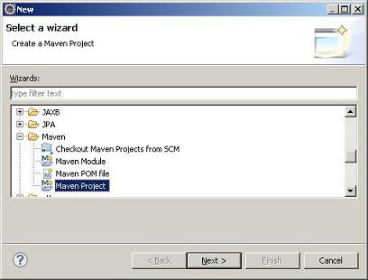
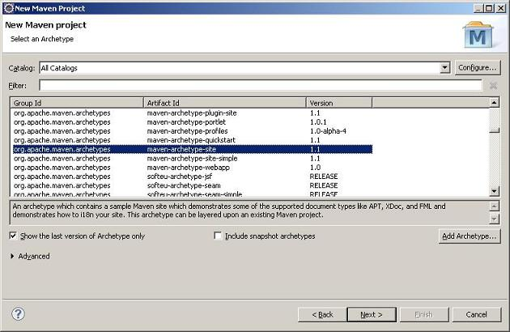

# 快速开始

本章将通过macula-samples的创建过程介绍通过Macula平台开发业务系统的整个过程，对于其中的部分代码内容，将不做过多介绍。

## 2.1 环境准备
“工欲善其事，必先利其器”，在开始介绍之前，我们需要准备相应的环境。

*   **Java SDK**

    Macula平台要求使用Java SDK的版本为1.6以上。
    
*   **Tomcat**

    选择Tomcat6.0以上版本。
    
*   **Eclipse**

    可选择最新的Eclipse 3.6.2版本，在Eclipse的多个发布版本中，选择Eclipse IDE for Java EE Developers，该版本包含了可部署的J2EE服务器适配。
    
*   **Maven-Eclipse插件**

    Maven插件： http://download.eclipse.org/technology/m2e/releases
    
    Maven-Wtp插件：在安装了上面的插件后，在Preference->Maven ->Discovery中，选择WTP插件安装。
    
*   **svn-Eclipse插件**

    SVN插件：http://subclipse.tigris.org/update_1.6.x/
    
*   **数据库（Oracle）**

    准备运行时需要的数据库资源。
    
另外，为了方便开发Freemarker模版等，可加入Freemarker IDE插件等，为了增强代码的健壮性，可加入FindBugs、CheckStyle等Eclipse插件。

##2.2 环境配置

* **文件编码设置**

    Macula平台要求使用UTF-8的文件编码格式，可通过Eclipse -> Preference -> General -> Workspace 中，设定Text file encoding的方式设置项目环境为UTF-8编码。
    
    
    
* **服务器设置**

    业务系统最终需要在J2EE容器中运行，这里选择Tomcat6.0作为服务器容器，在Eclipse中，需要进行相关配置。

    通过Eclipse -> Preference -> Server -> Runtime Envionment选取增加Apache Tomcat6.0服务：   
    
    
    
    
    
##2.3 项目的导入

以macula-samples为例，macula-samples采用svn+maven进行基础的代码管理与开发，下面通过maven平台自身的项目导入，来介绍已有项目的导入。

可通过svn下载macula平台代码（如放置在D:\workspace\macula-samples目录），然后通过Eclipse导入的方式将macula平台的代码导入。

导入方式为，选择File->Import->Maven->Existing Maven Projects的方式：


通过这种方式，可导入macula平台的所有子模块。

## 2.4 新建业务项目

通过Eclipse的新建Maven向导来创建新的业务工程项目。



在下一步中，可选择pom模块、jar模块或war，在新项目创建时，请选择pom模块的方式，创建项目根，其他模块以子模块的方式存在。

为创建一个pom模块的pom.xml，可以在向导中选择maven-archetype-site来创建。



从而可以得到一个项目的根目录，在这个项目跟目录中，用来处理打包、发布等，均写在该pom.xml中，具体可参考macula工程根下的pom.xml文件。

## 2.5 创建业务父模块

在创建了项目根后，我们并没有创建任何的项目模块，为了保证项目能使用一致的设置，需要创建项目业务模块的父模块，用XX-parent来命名，比如macula开发平台下的macula-parent，就是用来定义项目模块的父模块设置的。

创建的父模块作为根模块的子模块存在，与下一节介绍的业务子模块一样，都是通过打开根pom.xml，然后在图形化界面中，选择modules下的Create按钮来创建的。

在该父模块中，主要设置maven仓库地址，编译的jdk级别，使用的第三方库以及版本等，相关的信息可以参考macula-parent中的配置信息。

基于Macula平台开发中，只需要依赖macula-base即可。

## 2.6 创建业务子模块

设置了项目一致性的依赖、项目版本以及编译环境后，可通过maven插件打开跟目录下的pom.xml，在该界面中增加业务子模块。

以macula-samples为例，可以看出最终创建的子模块如下图所示：


其创建过程为通过点击Modules下的Create按钮，逐一创建子模块。

在创建子模块时，选择Parent-Project为上面创建的父模块。如创建macula-samples下的子模块macula-samples-demo时，需要选择macula-samples-parent作为Parent Project。


## 2.7 Webapp模块修改

最终部署运行的模块是创建的war模块，在当前开发下，可通过拷贝macula-webapp下的src/resources和src/webapp目录下的所有文件，然后对相关文件进行修改的方式进行。

* **web.xml修改**

    可将web显示的名称修改为需要的业务系统名称
    
* **macula.properties修改**

    需要修改应用的名称、应用实例的名称、CAS验证地址等信息。
    
* **applicationContext-root.xml修改**

    该文件主要修改连接数据库的信息。
通过修改上述文件后，即可完成项目的发布与部署。

## 2.8 打包

通过maven命令，mvn package可实现打包，如果需要发布到仓库中，可使用mvn install命令。

## 2.9 程序开发

### 2.9.1 概要介绍

Macula 框架使用了 Spring，JPA（Hibernate），JQuery和KnockoutJS 等关键技术，所以要想熟练掌握框架，需要对这些技术很熟悉。一般做过 Java 开发的对 Spring 和 JPA（Hibernate） 都会有些了解，但对 JQuery 和 KnockoutJS 可能了解不多，特别是 KnockoutJS。所以有必要加强对 JQuery 和 KnockoutJS 的学习。 下面列举了 JQuery 和 KnockoutJS 的教程的链接，希望能帮助开发人员快速掌握这两种技术。

JQuery 教程

http://docs.jquery.com/Tutorials

KnockoutJS 教程

http://learn.knockoutjs.com/

该教程是假设开发人员已经获取到 Macula 平台的代码，并且配置好了 Eclipse 开发环境。教程从实际开发角度出发，一步步详细解释了整个开发过程。

### 2.9.2 Domain 和 DAO 层

Macula 平台的 DAO 层基于 Spring-Data-JPA（hibernate） 做了一些封装，功能很全面，只要在指定 package 下定义好 domain model 和 Repository 接口，就可以实现很完善的数据存储功能。

#### 2.9.2.1 Domain 定义

Domain 的定义也是采用接口类和实现类的方式（业务系统中，可以接口与实现使用相同的类，简化开发的工作量），在实现类中通过 annotation 加上数据库表和字段的定义。 Domain 接口类放在 macula-xxx-base 资源包里，对应的 package 是类似这样：

```
package org.macula.uim.base.domain;
```

接口类示例：

```java
public interface User {

	/** 用户名 */
	String getUserName();

	/** 密码 */
	String getPassword();

	/** 用户类型 */
	String getUserType();
}
```

Domain 的实现类也是放在 macula-xxx-base 资源包里，对应的 package 是类似这样：

```java
package org.macula.uim.base.domain.impl;
```

实现类的示例：

```java
@Entity
@org.hibernate.annotations.Entity(dynamicInsert = true, dynamicUpdate = true)
@Table(name = "MA_UIM_USER")
public class JpaUIMUser extends AbstractAuditable<Long> implements User {

	private static final long serialVersionUID = Version.value();

	/** 用户名 */
	@Column(name = "USER_NAME", length = 50, nullable = false, unique = true)
	@Size(min = 3, max = 50)
	private String userName;

	/** 密码 */
	@Column(name = "PASSWORD", length = 50, nullable = false)
	@Size(min = 3, max = 50)
	@JsonIgnore
	@XStreamOmitField
	private String password;

	/** 用户类型 */
	@Column(name = "USER_TYPE", length = 3, nullable = false)
	@NotNull
	private String userType;
}
```

从实现类我们可以看到通过 annotation 加了数据库表和字段的定义，通过在EntityManagerFactory的定义中加入Domain所在的包后，Macula 平台可以自动扫描这些 Domain 定义，如果指定了自动生成数据库表结构，那么可以自动生成对应的数据库表。

#### 2.9.2.2 Repository 类定义

Repository 相当于 DAO 层，通过操作 Domain 存取数据。

Repository 一般只需要增加一个接口类，并且继承 MaculaJpaRepository 就可以，Macula 平台可以在运行环境中自动产生实现类，并实现常用的 DAO 操作。

Repository 接口的示例如下：

```java
public interface SyncSendLogRepository extends MaculaJpaRepository<JpaSyncSendLog, Long> {
```
如果常用的 DAO 操作不够用，可以定义特殊的 Repository 接口类，增加我们需要的方法，并增加相应的实现类。（这里涉及到一个Repository扫描的定义）

### 2.9.3 Service 层
我们需要在 Service 层提供常用的方法，比如 list、save、delete 等。

首先在 Service 接口类中增加方法定义，示例如下：
```java
Page<JpaUIMUser> getAllUsers(Pageable pageable); 
```
然后在 Service 实现类中增加实现方法，示例如下：
```java
@Override
public Page<JpaUIMUser> getAllUsers(Pageable pageable) {
	return uimUserRepository.findAll(pageable);
}
```
上面示例实现的是list方法，list一般需要支持分页功能。

该实现方法调用了 DAO 层的对应方法，这个方法是已经存在的，只要 UIMUserRepository 是按照 Macula 框架标准定义的就可以。

DAO 层的注入使用Spring的注入annotation，示例如下：
```java
@Autowired
private UIMUserRepository uimUserRepository;	
```
根据一定的命名规则，Macula 就可以自动完成 Repository 实例的注入，我们不需要考虑实例化的处理。

**新增加 Service 类需要注意的问题**

增加 Service 类一般是先定义 Service 接口类，然后定义 Service 实现类，注意要在 Service 实现类声明上面加上 annotation @Service，对于涉及到数据库修改的实现，需要加上@Transactional。

### 2.9.4 Controller 层

要选择专门存放 controller 类的 package 下，比如 org.macula.admin.base.controller 下。在 Controller 中一般需要调用 Service 层，Macula 框架使用Spring的注入annotation 来处理 Service 层的注入，示例如下：

```java
@Autowired
private UserManagerService userManagerService;
```

Autowired 来帮助我们把 Service 注入到 Controller 中，我们可以在 Controller 直接使用 Service 的各种接口，不需要考虑实例化的处理。

**新增加的 Controller 类需要注意的问题**

要在类声明上面加上 annotation @Controller，这个很重要，是让我们框架能自动识别这个类是 Controller 类，如果不加就会出问题。

这部分自动扫描 Controller 的配置是在各资源包的这个文件中

src/main/resources/META-INF/spring/macula-xxx-servlet.xml

里面有一行：

```java
<context:component-scan base-package="org.macula.admin.**.controller" />
```
是用来设置需要扫描哪些 package。

#### 2.9.4.1 Spring MVC 方式

方法声明里需要有 org.springframework.ui.Model 参数，方法上面需要加上 annotation @RequestMapping，映射到 URL 请求，示例：

```java
@RequestMapping(value = "/system/runtime", method = RequestMethod.GET)
public String showSnapshot(Model model) {
  …
}
```

需要传递给页面的数据采用 model.addAttribute(“attributeName”, attributeObject); 的方式，在FreeMarker 页面上采用 ${attributeName.propertyName} 的方式访问。

附：示例用到的 Java Bean 部分代码，下面的示例代码可能涉及这个 Bean：

```java
/**
 * @return the name
 */
public String getName() {
	return name;
}

/**
 * @return the vmName
 */
public String getVmName() {
	return vmName;
}
```

#### 2.9.4.2 AJAX JSON 方式

对于需要支持 AJAX JSON 的 controller 方法不需要 org.springframework.ui.Model 参数，需要增加 annotation @OpenApi，controller 方法可以直接返回 pojo bean。方法声明格式示例：

```java
@RequestMapping(value="/system/runtime/get",method=RequestMethod.GET)
@OpenApi
public RuntimeSnapshot getRuntimeSnapshot() {
	return RuntimeSnapshot.take();
}
```

返回的数据在页面上会通过 AJAX 的方式获取到。

因为大部分列表功能都是支持分页功能的，我们下面讲解一下怎样做支持分页的列表功能。

因为Macula的数据读取是采用 AJAX 的方式处理的。所以我们针对这个列表功能要增加两个 controller 方法，一个是用来显示页面，采用了 Spring MVC 的方式；另一个是用来读取数据给 AJAX 请求。

方法一示例：
```java
@RequestMapping(value = "/user/list", method = RequestMethod.GET)
public String list() {
	return super.getRelativePath("/user/list");
}
```

这个方法是用来显示页面，页面文件是 src/main/resources 对应 /user/ 目录下的 list.ftl 文件。

方法二示例：

```java
@RequestMapping(value = "/user/users", method = RequestMethod.POST)
@OpenApi
public Page<JpaUIMUser> getUsers(Pageable pageable) {
	return userManagerService.getAllUsers(pageable);
}	
```

这个方法是获取到一页数据，并把数据返回，是直接返回 bean list 结果，到 AJAX 客户端会转成 JSON 格式。

###2.9.5 页面层

页面部分有两个文件，一个是 .ftl 文件，另一个是 .js 文件，.ftl 文件是定义页面显示界面，.js 文件是 JavaScript 逻辑，用于实现数据的存取处理。在ftl文件中，通过scriptJs把javascript逻辑包含进来。

####2.9.5.1 Spring MVC 方式

只需要增加 .ftl 页面，在 .ftl 页面里采用 FreeMarker 的方式访问返回的数据。

示例：
```
${runtime.name}
${runtime.vmName}
```
####2.9.5.2 AJAX JSON 方式

需要增加 .ftl 页面和对应的 .js 文件，在 .js 文件里实现数据的读取和绑定处理，采用了 KnockoutJS 的技术。

.ftl 页面示例：
```
<span data-bind="text: name"></span>
<span data-bind="text: vmName"><span>
```
.js 文件示例：
```javascript
$(function() {
	var code = 'system-runtime';

	var viewModel = ko.mapping.fromJS({
		name : '',
		vmName : '',
	});

	ko.applyBindings(viewModel);
			
	$.getJSON(base + '/admin/macula-base/system/runtime/get', function(data) {
		ko.mapping.updateFromJS(viewModel, data.returnObject);
	});
});
```
#### 2.9.5.3 List 页面

List 页面主要分为3个部分，第一部分是上面的功能按钮部分，第二部分是中间的数据列表显示部分，第三部分是下面的分页处理部分。

整个页面的结构是这样的：

```
<@layout.ajaxContent title="用户列表" scripts="admin/macula-uim/user/list.js">
	<#assign code="user-list" />
	<@layout.content_head>
		功能按钮部分
	</@layout.content_head>

	<@layout.content_main>
		数据列表显示部分
	</@layout.content_main>

<@layout.content_foot>  //分页处理部分，这部分基本都是一样的
		<@layout.content_pager "${code}"/>
</@layout.content_foot>
</@layout.ajaxContent>
```

页面部分用到了 JQuery 和 KnockoutJS 技术，两种技术结合到一起使用，看起来不太容易理解。下面从功能按钮部分开始，详细讲解一下相关内容。

**功能按钮部分**

看一下新增按钮在页面中的定义：

```
<button id="finder-add-action-${code}" type="button" class="btn btn-has-icon"
	href="javascript:void(0);" target="dialog::{title: '新增用户', width:'650',height:'600'}"
	url="admin/macula-uim/user/create">
	<span><span><i class="btn-icon"><@macula.themeImage src="bundle/btn_add.gif"/></i>新增用户</span></span>
</button>
```

这个按钮是弹出一个对话框，显示新增的界面，里面没有太多处理，主要需要注意 target 和 url 的定义，”dialog” 表示以一个 DIV 层的方式显示对话框，可以定义对话框的标题、宽和高。url 是对话框要显示的页面的 url。

再看一下编辑按钮，编辑按钮是在列表中选中一条记录后点击来修改记录。

```
<button id="finder-edit-action-${code}" type="button" class="btn btn-has-icon" data-bind="click: onEditAction, enable: onEditEnable"
	href="javascript:void(0);" target="dialog::{title: '编辑用户', width:'650',height:'600'}">
	<span><span><i class="btn-icon"><@macula.themeImage src="bundle/btn_edit.gif"/></i>编辑</span></span>
</button>
```

这个按钮需要注意的是 data-bind 的用法，data-bind 是 KnockoutJS 提供的功能，用于绑定数据或者事件，对应绑定方法的定义是在 .js 文件中，代码如下：

```javascript
actionsViewModel.onEditAction = function(e) {
	var row = actionsViewModel.selectedRow();
	if (row != null) {
		$(e.currentTarget).attr('url',
				'admin/macula-uim/user/edit/' + row.id);
		return true;
	}
	e.stopPropagation();
	return false;
};
```

**数据列表显示部分**

这部分主要是定义表格结构和要显示的数据内容，采用了 KnockoutJS 的Model和View绑定技术。定义表格结构示例如下：

```html
<table class="treeTable gridlist">
	<thead>
		<th>用户名</th>
		<th>用户姓名</th>
		<th>是否有效</th>
		<th>用户类型 </th>
		<th>用户来源</th>
		<th>用户编号</th>
		<th>所属组织</th>
	</thead>
	<tbody data-bind="template: { name: 'finder-data-tmpl-${code}' }" />					
</table>
```
这个结构先是定义表头，然后是数据绑定设置。

```
<tbody data-bind="template: { name: 'finder-data-tmpl-${code}' }" />
```

这个是说明表格的数据是由 KnockoutJS 的模板绑定方式定义的，模板部分的定义示例如下：

```
<script id="finder-data-tmpl-${code}" type="text/x-jquery-tmpl">
<#noparse>
	{{each(i,row) content}}
		<tr class="{{if i%2 == 0}}even{{else}}odd{{/if}}" data-bind="click: function(e) { onRowClick(e,row); }">
			<td>${userRealName}</td>
			<td>${userName}</td>
			<td>${enabled}</td>
			<td>${userType}</td>	
			<td>${userFrom}</td>
			<td>${userNo}</td>
			<td>${orgCode}</td>
		</tr>
	{{/each}} 
</#noparse>
</script>
```

对应 .js 文件中数据的定义是这样

```
var tableViewModel = ko.mapping.fromJS({
	content : []
});

	
ko.applyBindings(tableViewModel, $('#finder-list-user-list'));
```

上面代码是把数据跟视图绑定到一起。

数据是存放到 content 数组中的，页面通过 AJAX 请求服务端 controller 上对应的方法，然后以 JSON 的格式获取到，然后再放到 content 数组中。因为该数据已经跟页面视图对应的显示表格绑定起来，那显示表格就可以自动显示出数据。

读取数据的逻辑示例如下：

```javascript
Parts['search'].ajaxSubmit({
	url	: base + '/admin/macula-uim/user/users',
	dataType : 'json',
	success	: function(data) {
		eventBindingElement.trigger(Constants.data_arrive_event, [data]);
	}
});	
```

上面代码中我们可以看到在服务端成功执行后返回数据时会触发一个 event，这个 event 会被绑定到一段 JS 代码，来完成页面上数据的刷新。实际代码如下：

```javascript
eventBindingElement.bind(Constants.data_arrive_event, function(e, data) {
	PageData.dataTotal = data.totalElements;
	// 将列表数据赋给列表ViewModel
	tableViewModel.content(data.content);
	
	if (data.content && data.content.length) {
		Parts['nodata'].hideme();
	} else {
		Parts['nodata'].showme();
	}
})
```

**分页处理部分**

首先页面的下面需要有这段代码:

```
<@layout.content_foot>
	<@layout.content_pager "${code}"/>
</@layout.content_foot>
```

然后 .js 文件中通过下面代码处理分页

```javascript
Parts['pager'].maculapagination({
	code	: code
});	
          
```

#### 2.9.5.4 新增及修改页面

新增和修改页面一般使用相同的 .ftl 和 .js 文件，通过逻辑判断当前处理的操作是新增还是修改操作。如果新增和修改功能差别很大，就需要考虑分开两个页面。我们下面以相同页面做示例讲解一下。

首先在 src/main/resources/views 目录下，根据 URL 建立相应的子目录，然后增加2个文件 edit.ftl 和 edit.js。比如在 macula-uim-admin 资源包中，对应 /usr/edit URL 需要在 src/main/resources/views/admin/macula-uim/users/ 目录下增加 edit.ftl 和 edit.js。

/admin/macula 目录是由 macula-uim-admin 资源包里的基本 Controller 类 UIMController 定义的，其他的 Controller 类都是继承了 UIMController，对应的定义代码如下：

```java
@RequestMapping("admin/macula-uim")
public abstract class UIMController extends BaseController {
```

而在其他 Controller 类中，只需要定义 admin/macula-uim 下面的 URL 部分就可以，示例代码如下：

```java
@RequestMapping(value = "/user/create", method = RequestMethod.GET)
public String create() {
	return super.getRelativePath("/user/edit");
}
```

上面的示例是对应 URL 请求 admin/macula-uim/user/create 到目录 src/main/resources/views/admin/macula-uim/users/ 下的 edit.ftl 文件。

**edit.ftl 文件**

这个文件定义了页面显示结构，主要分为下面几个部分：

```
<#assign code="edit-user" />
<#assign title>
	<#if id?exists>编辑xxx<#else>新增xxx</#if>
</#assign>	
<@layout.ajaxContent title=title scripts="admin/macula-uim/user/edit.js">
	<@layout.content_main>	
		页面内容
	</@layout.content_main>
</@layout.ajaxContent>
```

这个文件是比较容易理解的，首先是定义页面的 title，通过判断一个 id 参数，使用了 freemarker 的标签处理。然后是页面内容，一般都是一个表格，对应着 label 和输入框，示例如下：

```html
<div id="page-${code}" class="tableform">
<form id="form-${code}" item-id="${id?if_exists}" action="${base}/admin/macula-uim/user/saveuser" method="post">
<input type="hidden" name="user.id" data-bind="value: id" />
<div class="division">
	<table cellspacing="0" cellpadding="0" border="0">
		<tbody>
			<tr>
				<th><label>用户名：</label></th>
				<td><input type="text" name="user.userName" maxlength="50" data-bind="value: userName" validate="required:true,rangelength:[1,20]" style="width: 200px;" /></td>
			</tr>
			<tr>
				<th><label>密码：</label></th>
				<td><input type="password" name="user.password" id="password" maxlength="50" data-bind="value: password" validate="required:true,minlength:6" style="width: 200px;" /></td>
			</tr>
	</table>
</div>
<div class="table-action">
	<button type="submit" class="btn btn-primary">
		<span><span>保存</span></span>
	</button>
	<button type="button" class="btn btn-secondary cancel-btn">
		<span><span>关闭</span></span>
	</button>
							
</div>
</form>		
</div>
```

里面要注意的是对于输入框的定义，有个数据绑定（data-bind）的处理，我们在下面 edit.js 里会说明。

**edit.js 文件**

这个文件主要是完成3项工作：

1. 定义跟 edit.ftl 页面里对应的 model
2. 绑定 edit.ftl 页面里对应的按钮操作
3. 通过 Ajax 读取服务器端的数据

**Model 定义方面示例代码是这样的**

```javascript
var viewModel = ko.mapping.fromJS({
	id : '',
	userName : '',
	password : '',
});
```

页面里输入框通过这个方式跟 model 绑定起来

data-bind="value: userName"

绑定后我们在 JavaScript 代码中修改 userName 值的时候，页面中输入框的值也会跟着变化（这是使用了 KnockoutJS 的技术）。

绑定页面按钮操作示例代码

```javascript
$form.find('.cancel-btn').click(function() {
	$(this).trigger('closeDialog');
});
```

上面代码说明在点击取消按钮的时候，会调用 closeDialog 方法，这个方法是 Macula 框架提供的，会关闭弹出的对话框。

**通过 Ajax 读取服务器端的数据示例代码**

```javascript
var currentId = $form.attr('item-id');
if (currentId) {
	$.getJSON(base + '/admin/macula-uim/user/get/' + currentId,
			function(data) {
				ko.mapping.updateFromJS(viewModel, data.returnObject);
				viewModel.rePassword = viewModel.password;
				ko.applyBindings(viewModel, $content[0]);
			});
}
```

上面代码使用了 JQuery 技术向服务器端发起请求，并以 JSON 的方式接收服务器端返回的数据，服务器端一般以 bean 或者 bean list 的方式返回数据，JQuery 会自动转成 JSON 格式，方便页面上使用。

#### 2.9.5.5 删除功能

删除功能一般是直接在 list 页面里做的，选中某条记录，然后点击删除按钮，会使用 JQuery 的方式调用服务器端相应的处理，然后根据返回值做结果提示。

我们先看一下 list 页面上对于删除功能按钮的定义

```
<button id="finder-delete-action-${code}" type="button" class="btn btn-has-icon" data-bind="click: onDeleteAction, enable: onDeleteEnable"
	href="javascript:void(0);" target="command">
	<span><span><i class="btn-icon"><@macula.themeImage src="bundle/delete.gif"/></i>删除</span></span>
</button>
```

上面代码就定义了点击按钮会触发 onDeleteAction 方法，这个方法是在 list.js 里定义的，代码如下

```javascript
actionsViewModel.onDeleteAction = function(e) {
	var row = actionsViewModel.selectedRow();
	if (row != null && confirm('您确定要删除用户' + '【' + row.id + '】吗？')) {
		$(e.currentTarget).attr('url',
				'admin/macula-uim/user/delete/' + row.id);
		return true;
	}
	e.stopPropagation();
	Parts['refresh'].trigger('click');
	return false;
};
```

我们可以看到，该功能会先提示用户是否确认要删除，确认后会调用服务器端对应的处理。

### 2.9.6 开发技巧汇总

#### 2.9.6.1 调用 URL 刷新内容区域

**1. 在 HTML 的 <A HREF 中使用**
```html
<a href="JavaScript:void(0);" target="update" url="admin/macula-base/system/runtime/gc">触发内存回收</a>
```

关键是 target 的使用，Macula 的 UI 框架能够根据 target 做不同处理。

target 的几个主要用法是：

* _blank 和 blank，这是新开浏览器窗口；
* menu 是以菜单的方式打开；
* dialog 是以 DIV 对话框的方式打开；
* update 是更新页面上某一个部分的内容；
* replace 是替换某部分内容 。

**2. 在 JavaScript 代码中使用**

```javascript
$(document.body).updateContents(base + '/admin/macula-base/system/runtime');
```
用了 updateContents，方法很巧妙。


#### 2.9.6.2 通过 jQuery 提交表单并获得返回结果

做 Web 程序开发经常遇到的一个问题是提交表单后显示操作结果，按照传统做法是额外增加一个显示结果的 Web 页面，这个方法增加了开发工作量，而且额外增加了一个以后需要维护的文件。

还有个常用的方法是继续使用当前的页面，把返回信息显示在当前页面表单的上方。但这样需要重新刷新当前页面，而且还要把已经输入的各个数据重新放置到各输入框中，对于一些复杂的像下拉框输入，还要涉及重新取下拉框数据，实现比较麻烦而且对性能有影响。

我们可以用 jQuery 来实现这个处理，并且根据提交的返回信息直接在页面端用 JavaScript 显示出来，不需要刷新页面，也不需要增加额外的文件，很方便。下面我就讲解一下实现方法。

下面这个例子是用于实现修改密码的功能，用户输入旧密码和新密码后提交，服务器端要判断旧密码是否跟数据库中的一致，如果不一致就显示错误信息。如果没有错误信息返回就说明修改成功，页面就显示修改成功的信息。

先看 .ftl 页面文件对表单的定义：

```html
<form id="form-${code}" action="${base}/admin/macula-uim/user/savepassword" method="post">
	<div class="division">
		<table cellspacing="0" cellpadding="0" border="0">
			<tbody>
				<tr>
					<th><label>用户名：</label></th>
					<td><input type="text" name="username" maxlength="50" validate="required:true,rangelength:[1,20]" style="width: 200px;" /></td>
				</tr>
				<tr>
					<th><label>旧密码：</label></th>
					<td><input type="password" name="oldpassword" maxlength="50" validate="required:true,minlength:6" style="width: 200px;" /></td>
				</tr>
				<tr>
					<th><label>新密码：</label></th>
					<td><input type="password" name="newpassword" id="newpassword" maxlength="50" validate="required:true,minlength:6" style="width: 200px;" /></td>
				</tr>
				<tr>
					<th><label>再次输入新密码：</label></th>
					<td><input type="password" name="reNewpassword" maxlength="50" validate="required:true,minlength:6,equalTo:'#newpassword'" style="width: 200px;" /></td>
				</tr>
			</tbody>
		</table>
	</div>
	
	<div class="table-action">
		<button type="submit" class="btn btn-primary">
			<span><span>保存</span></span>
		</button>
		<button type="button" class="btn btn-secondary cancel-btn">
			<span><span>关闭</span></span>
		</button>
	</div>			
</form>
```

上面定义了一个表格样子的 form。

然后看一下 .js 文件的内容：

```javascript
var $content = $('#page-' + code);
var $form = $content.find('form:first');
$.metadata.setType('attr', 'validate');
var validator = $form.validate({
	submitHandler : function(form) {
		$(form).ajaxSubmit(
				{
					success : function(data) {
						if (data.success) {
							MessageBox.info('保存成功!', true);
						} else {
							var errors = {};
							$(data.validateErrors).each(function() {
								errors[this.element] = this.message;
							});
							validator.showErrors(errors);
							if( data.exceptionMessage ) {
								MessageBox.info ('【错误】' + data.exceptionMessage, true);
							}
						}
					}
				});
	}
});
```

上面是把表单提交的处理绑定到一个方法，方式是采用 AJAX 的方式提交表单，然后根据提交结果显示不同信息。返回结果 data 是一个 JSON 对象，属性 data.success 是判断操作是否成功，说明操作完成而且没有抛出异常。如果有错误返回那 data.success 就是 false，通过 data.exceptionMessage 就可以显示出错误信息。

下面我们再看一下服务器端的处理。

Controller 的代码是：

```java
@RequestMapping(value = "/user/savepassword", method = RequestMethod.POST)
@OpenApi
public Long savePassword(@RequestParam("username") String username, 
						 @RequestParam("oldpassword") String oldPassword,
						 @RequestParam("newpassword") String newPassword) {
	
	return userManagerService.changePassword(username, oldPassword, newPassword);
}
```

这个看起来很简单，调用了 Service 的一个方法。

再看 Service 代码：

```java
@Override
@Transactional
public Long changePassword(String username, String oldPassword, String newPassword)
{
	JpaUIMUser user = uimUserRepository.findByUserName(username);
	
	if (user == null)
	{
		throw new UIMException("macula.uim.user.changePwds.invalidUserName");
	}
	
	//if the old password is different from the submitted password, will throw an exception
	if ( !user.getPassword().equals(getPasswordEncoder().encodePassword(oldPassword,null)) )
	{
		throw new UIMException("macula.uim.user.changePwds.invalidOldPassword");
	}
	
	user.setPassword(getPasswordEncoder().encodePassword(newPassword, null));
	
	uimUserRepository.save(user);
	
	return user.getId();
}
```

上面代码我们可以看出，在检查数据出现问题的时候就抛出异常 UIMException，异常的参数是一个 Message 的 Code，比如 macula.uim.user.changePwds.invalidUserName 是在程序所在资源包的 src/main/resources/i18n 下对应的几个 messages.properties 文件里定义的，针对每种语言定义一个 Message Code，以及对应的信息。

在抛出异常的时候 Macula 框架会捕获并且读取到对应的错误信息，并且创建一个返回对象，返回对象会包裹返回值和错误信息。

页面端会以 JSON 的方式获取到服务器端返回的对象，然后进行结果判断，并且显示对应的信息。

#### 2.9.6.3 如何做下拉框输入功能

下拉框是我们开发Web应用经常需要用到的，下面我讲解一下 Macula 框架中如何实现下拉框功能。

我们需要先在数据库中一个统一的表中定义好下拉框的数据，有 Value 和 Label。数据可以是常量也可以是从其他表中获取的，数据库表的名字是：MA_BASE_DATA_PARAM，里面关键的几个字段是 CODE、NAME和VALUE，其他字段数据可以参照已有记录。

示例分别如下：

**1.常量下拉框数据定义**

```
CODE：language
NAME：语言
VALUE：1:中文|2:英文
```

上面就定义了一个下拉框的数据，是语言选择的，有两个数据，一个是中文，另一个是英文，对应的数据值分别是 1 和 2。

**2.动态下拉框数据定义**

```
CODE：datasource_list
NAME：数据源列表
VALUE：select name as label, id as code from ma_base_data_source
```

上面例子定义了一个动态下拉框数据，关键是 VALUE 字段的 SQL 语句，需要有 code 和 label 两个字段名，以 as 的方式把其他字段名转为 code 和 label。

在页面上使用示例如下：

```html
<select name="user.locale" data-bind="options: $Param('language'), optionsText: 'label', optionsValue:'code', value: locale" />
```

页面使用方法对于常量数据和动态数据都是一样的，采用 data-bind 的方式用 $Param 把下拉框数据填充到下拉框里。

#### 2.9.6.4 如何做 Checkbox 输入功能

用我们框架实现Checkbox 功能有点小技巧，需要用到额外的一个 hidden 字段用于保存 Checkbox 的值。实现示例如下：

```html
<input type="hidden" name="user.enabled" data-bind="value: enabled, type: 'boolean' " />
<input type="checkbox" data-bind="checked: enabled" />
```

页面上显示的是 Checkbox，它跟页面 model 中的 enabled 属性绑定，还有一个 hidden 字段也是跟 enabled 属性对应，而且定义它的 type 是 boolean。

如果没有那个 hidden 字段那我们选择 Checkbox 的值就无法保存到服务器端，主要是因为我们在 Domain 层定义的 enabled 属性是 Boolean 类型，而页面里的 Checkbox 可以是任意值，所以需要一点额外的转换处理。

#### 2.9.6.5 如何做 Radio 输入功能

Radio 输入功能相对 Checkbox 就很容易实现，因为 Radio 控件对应的数据值是直接保存到数据库中的，不需要做额外的转换处理。示例如下：

```html
<input type="radio" name="user.sex" value="M" data-bind="checked: sex"/>男
<input type="radio" name="user.sex" value="F" data-bind="checked: sex"/>女
```

上面就实现了两个 Radio，都绑定页面 Model 上的 sex 属性，每个 Radio 对应的 Value 是不同的，根据选择不同在服务器端保存的值也不同。 (框架同时也提供了radiolist与checkboxlist可以使用，具体示例可以用关键字 checkboxlist或 radiolist 搜索 .ftl 文件)

#### 2.9.6.6 使用日期输入控件

我们框架采用了一个叫作 My97 的日期输入控件，控件的官方网址是：

http://www.my97.net/

这个控件的功能比较全面，我们常用的限定日期可选范围，比如在某一天以前，或者在页面上某个日期输入框的值以后等等。下面示例是有效日期和失效日期，是一个常见的日期处理功能。

```
<input type="text" id="effectiveDate" name="user.effectiveDate" data-bind="value: effectiveDate, type:'date'" autocomplete="off" class="Wdate" onFocus="WdatePicker({dateFmt:'${dateTimePattern}'})"/>

<input type="text" name="user.inactiveDate" data-bind="value: inactiveDate, type:'date'" autocomplete="off" class="Wdate" onFocus="WdatePicker({dateFmt:'${dateTimePattern}',minDate:'#F{$dp.$D(\'effectiveDate\')}'})"/>
                    
```

上面第一个是有效日期，第二个是失效日期。

我们可以看到 Wdate 用来区分这个是日期输入控件，有个 ${dateTimePattern} 是日期时间格式，这个是统一在 src/main/resources 目录下的 macula.properties 文件里定义的。

在失效日期中，有个设置是 minDate:'#F{$dp.$D(\'effectiveDate\')}'，这个是限定这个日期值要大于有效日期的输入框的日期值。
