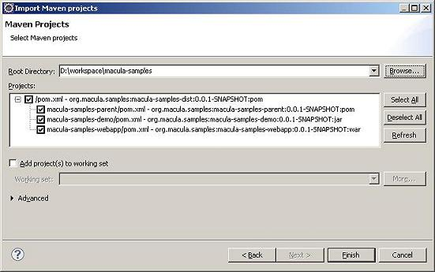

# 快速开始

本章将通过macula-samples的创建过程介绍通过Macula平台开发业务系统的整个过程，对于其中的部分代码内容，将不做过多介绍。

## 2.1 环境准备
“工欲善其事，必先利其器”，在开始介绍之前，我们需要准备相应的环境。

*   **Java SDK**

    Macula平台要求使用Java SDK的版本为1.6以上。
    
*   **Tomcat**

    选择Tomcat6.0以上版本。
    
*   **Eclipse**

    可选择最新的Eclipse 3.6.2版本，在Eclipse的多个发布版本中，选择Eclipse IDE for Java EE Developers，该版本包含了可部署的J2EE服务器适配。
    
*   **Maven-Eclipse插件**

    Maven插件： http://download.eclipse.org/technology/m2e/releases
    
    Maven-Wtp插件：在安装了上面的插件后，在Preference->Maven ->Discovery中，选择WTP插件安装。
    
*   **svn-Eclipse插件**

    SVN插件：http://subclipse.tigris.org/update_1.6.x/
    
*   **数据库（Oracle）**

    准备运行时需要的数据库资源。
另外，为了方便开发Freemarker模版等，可加入Freemarker IDE插件等，为了增强代码的健壮性，可加入FindBugs、CheckStyle等Eclipse插件。

##2.2 环境配置

* **文件编码设置**

    Macula平台要求使用UTF-8的文件编码格式，可通过Eclipse -> Preference -> General -> Workspace 中，设定Text file encoding的方式设置项目环境为UTF-8编码。
    
    
    
* **服务器设置**

    业务系统最终需要在J2EE容器中运行，这里选择Tomcat6.0作为服务器容器，在Eclipse中，需要进行相关配置。

    通过Eclipse -> Preference -> Server -> Runtime Envionment选取增加Apache Tomcat6.0服务：   
    
    
    
    
    
##2.3 项目的导入

以macula-samples为例，macula-samples采用svn+maven进行基础的代码管理与开发，下面通过maven平台自身的项目导入，来介绍已有项目的导入。

可通过svn下载macula平台代码（如放置在D:\workspace\macula-samples目录），然后通过Eclipse导入的方式将macula平台的代码导入。

导入方式为，选择File->Import->Maven->Existing Maven Projects的方式：




通过这种方式，可导入macula平台的所有子模块。

## 2.4 新建业务项目

通过Eclipse的新建Maven向导来创建新的业务工程项目。


在下一步中，可选择pom模块、jar模块或war，在新项目创建时，请选择pom模块的方式，创建项目根，其他模块以子模块的方式存在。

为创建一个pom模块的pom.xml，可以在向导中选择maven-archetype-site来创建。


从而可以得到一个项目的根目录，在这个项目跟目录中，用来处理打包、发布等，均写在该pom.xml中，具体可参考macula工程根下的pom.xml文件。

## 2.5 创建业务父模块

在创建了项目根后，我们并没有创建任何的项目模块，为了保证项目能使用一致的设置，需要创建项目业务模块的父模块，用XX-parent来命名，比如macula开发平台下的macula-parent，就是用来定义项目模块的父模块设置的。

创建的父模块作为根模块的子模块存在，与下一节介绍的业务子模块一样，都是通过打开根pom.xml，然后在图形化界面中，选择modules下的Create按钮来创建的。

在该父模块中，主要设置maven仓库地址，编译的jdk级别，使用的第三方库以及版本等，相关的信息可以参考macula-parent中的配置信息。

基于Macula平台开发中，只需要依赖macula-base即可。

## 2.6 创建业务子模块

设置了项目一致性的依赖、项目版本以及编译环境后，可通过maven插件打开跟目录下的pom.xml，在该界面中增加业务子模块。

以macula-samples为例，可以看出最终创建的子模块如下图所示：


其创建过程为通过点击Modules下的Create按钮，逐一创建子模块。

在创建子模块时，选择Parent-Project为上面创建的父模块。如创建macula-samples下的子模块macula-samples-demo时，需要选择macula-samples-parent作为Parent Project。


## 2.7 Webapp模块修改

最终部署运行的模块是创建的war模块，在当前开发下，可通过拷贝macula-webapp下的src/resources和src/webapp目录下的所有文件，然后对相关文件进行修改的方式进行。

* **web.xml修改**

    可将web显示的名称修改为需要的业务系统名称
    
* **macula.properties修改**

    需要修改应用的名称、应用实例的名称、CAS验证地址等信息。
    
* **applicationContext-root.xml修改**

    该文件主要修改连接数据库的信息。
通过修改上述文件后，即可完成项目的发布与部署。

## 2.8 打包

通过maven命令，mvn package可实现打包，如果需要发布到仓库中，可使用mvn install命令。

## 2.9 程序开发

### 2.9.1 概要介绍

Macula 框架使用了 Spring，JPA（Hibernate），JQuery和KnockoutJS 等关键技术，所以要想熟练掌握框架，需要对这些技术很熟悉。一般做过 Java 开发的对 Spring 和 JPA（Hibernate） 都会有些了解，但对 JQuery 和 KnockoutJS 可能了解不多，特别是 KnockoutJS。所以有必要加强对 JQuery 和 KnockoutJS 的学习。 下面列举了 JQuery 和 KnockoutJS 的教程的链接，希望能帮助开发人员快速掌握这两种技术。

JQuery 教程

http://docs.jquery.com/Tutorials

KnockoutJS 教程

http://learn.knockoutjs.com/

该教程是假设开发人员已经获取到 Macula 平台的代码，并且配置好了 Eclipse 开发环境。教程从实际开发角度出发，一步步详细解释了整个开发过程。

### 2.9.2 Domain 和 DAO 层

Macula 平台的 DAO 层基于 Spring-Data-JPA（hibernate） 做了一些封装，功能很全面，只要在指定 package 下定义好 domain model 和 Repository 接口，就可以实现很完善的数据存储功能。

#### 2.9.2.1 Domain 定义

Domain 的定义也是采用接口类和实现类的方式（业务系统中，可以接口与实现使用相同的类，简化开发的工作量），在实现类中通过 annotation 加上数据库表和字段的定义。 Domain 接口类放在 macula-xxx-base 资源包里，对应的 package 是类似这样：

```
package org.macula.uim.base.domain;
```

接口类示例：

```
public interface User {

	/** 用户名 */
	String getUserName();

	/** 密码 */
	String getPassword();

	/** 用户类型 */
	String getUserType();
}
```

Domain 的实现类也是放在 macula-xxx-base 资源包里，对应的 package 是类似这样：

```
package org.macula.uim.base.domain.impl;
```

实现类的示例：

```
@Entity
@org.hibernate.annotations.Entity(dynamicInsert = true, dynamicUpdate = true)
@Table(name = "MA_UIM_USER")
public class JpaUIMUser extends AbstractAuditable<Long> implements User {

	private static final long serialVersionUID = Version.value();

	/** 用户名 */
	@Column(name = "USER_NAME", length = 50, nullable = false, unique = true)
	@Size(min = 3, max = 50)
	private String userName;

	/** 密码 */
	@Column(name = "PASSWORD", length = 50, nullable = false)
	@Size(min = 3, max = 50)
	@JsonIgnore
	@XStreamOmitField
	private String password;

	/** 用户类型 */
	@Column(name = "USER_TYPE", length = 3, nullable = false)
	@NotNull
	private String userType;
}
```

从实现类我们可以看到通过 annotation 加了数据库表和字段的定义，通过在EntityManagerFactory的定义中加入Domain所在的包后，Macula 平台可以自动扫描这些 Domain 定义，如果指定了自动生成数据库表结构，那么可以自动生成对应的数据库表。

#### 2.9.2.2 Repository 类定义

Repository 相当于 DAO 层，通过操作 Domain 存取数据。

Repository 一般只需要增加一个接口类，并且继承 MaculaJpaRepository 就可以，Macula 平台可以在运行环境中自动产生实现类，并实现常用的 DAO 操作。

Repository 接口的示例如下：

```
public interface SyncSendLogRepository extends MaculaJpaRepository<JpaSyncSendLog, Long> {
```
如果常用的 DAO 操作不够用，可以定义特殊的 Repository 接口类，增加我们需要的方法，并增加相应的实现类。（这里涉及到一个Repository扫描的定义）
