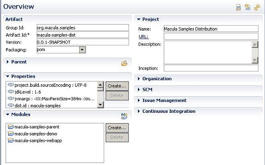
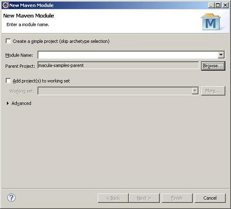

# 快速开始

本章将通过macula-samples的创建过程介绍通过Macula平台开发业务系统的整个过程，对于其中的部分代码内容，将不做过多介绍。

## 2.1 环境准备


##2.2 环境配置


    
##2.3 项目的导入


## 2.4 新建业务项目


## 2.5 创建业务父模块

在创建了项目根后，我们并没有创建任何的项目模块，为了保证项目能使用一致的设置，需要创建项目业务模块的父模块，用XX-parent来命名，比如macula开发平台下的macula-parent，就是用来定义项目模块的父模块设置的。

创建的父模块作为根模块的子模块存在，与下一节介绍的业务子模块一样，都是通过打开根pom.xml，然后在图形化界面中，选择modules下的Create按钮来创建的。

在该父模块中，主要设置maven仓库地址，编译的jdk级别，使用的第三方库以及版本等，相关的信息可以参考macula-parent中的配置信息。

基于Macula平台开发中，只需要依赖macula-base即可。

## 2.6 创建业务子模块

设置了项目一致性的依赖、项目版本以及编译环境后，可通过maven插件打开跟目录下的pom.xml，在该界面中增加业务子模块。

以macula-samples为例，可以看出最终创建的子模块如下图所示：



其创建过程为通过点击Modules下的Create按钮，逐一创建子模块。

在创建子模块时，选择Parent-Project为上面创建的父模块。如创建macula-samples下的子模块macula-samples-demo时，需要选择macula-samples-parent作为Parent Project。



## 2.7 Webapp模块修改

最终部署运行的模块是创建的war模块，在当前开发下，可通过拷贝macula-webapp下的src/resources和src/webapp目录下的所有文件，然后对相关文件进行修改的方式进行。

* **web.xml修改**

    可将web显示的名称修改为需要的业务系统名称
    
* **macula.properties修改**

    需要修改应用的名称、应用实例的名称、CAS验证地址等信息。
    
* **applicationContext-root.xml修改**

    该文件主要修改连接数据库的信息。
通过修改上述文件后，即可完成项目的发布与部署。

## 2.8 打包

通过maven命令，mvn package可实现打包，如果需要发布到仓库中，可使用mvn install命令。

## 2.9 程序开发

### 2.9.1 概要介绍

Macula 框架使用了 Spring，JPA（Hibernate），JQuery和KnockoutJS 等关键技术，所以要想熟练掌握框架，需要对这些技术很熟悉。一般做过 Java 开发的对 Spring 和 JPA（Hibernate） 都会有些了解，但对 JQuery 和 KnockoutJS 可能了解不多，特别是 KnockoutJS。所以有必要加强对 JQuery 和 KnockoutJS 的学习。 下面列举了 JQuery 和 KnockoutJS 的教程的链接，希望能帮助开发人员快速掌握这两种技术。

JQuery 教程

http://docs.jquery.com/Tutorials

KnockoutJS 教程

http://learn.knockoutjs.com/

该教程是假设开发人员已经获取到 Macula 平台的代码，并且配置好了 Eclipse 开发环境。教程从实际开发角度出发，一步步详细解释了整个开发过程。

### 2.9.2 Domain 和 DAO 层

Macula 平台的 DAO 层基于 Spring-Data-JPA（hibernate） 做了一些封装，功能很全面，只要在指定 package 下定义好 domain model 和 Repository 接口，就可以实现很完善的数据存储功能。

#### 2.9.2.1 Domain 定义

Domain 的定义也是采用接口类和实现类的方式（业务系统中，可以接口与实现使用相同的类，简化开发的工作量），在实现类中通过 annotation 加上数据库表和字段的定义。 Domain 接口类放在 macula-xxx-base 资源包里，对应的 package 是类似这样：

```
package org.macula.uim.base.domain;
```

接口类示例：

```java
public interface User {

	/** 用户名 */
	String getUserName();

	/** 密码 */
	String getPassword();

	/** 用户类型 */
	String getUserType();
}
```

Domain 的实现类也是放在 macula-xxx-base 资源包里，对应的 package 是类似这样：

```java
package org.macula.uim.base.domain.impl;
```

实现类的示例：

```java
@Entity
@org.hibernate.annotations.Entity(dynamicInsert = true, dynamicUpdate = true)
@Table(name = "MA_UIM_USER")
public class JpaUIMUser extends AbstractAuditable<Long> implements User {

	private static final long serialVersionUID = Version.value();

	/** 用户名 */
	@Column(name = "USER_NAME", length = 50, nullable = false, unique = true)
	@Size(min = 3, max = 50)
	private String userName;

	/** 密码 */
	@Column(name = "PASSWORD", length = 50, nullable = false)
	@Size(min = 3, max = 50)
	@JsonIgnore
	@XStreamOmitField
	private String password;

	/** 用户类型 */
	@Column(name = "USER_TYPE", length = 3, nullable = false)
	@NotNull
	private String userType;
}
```

从实现类我们可以看到通过 annotation 加了数据库表和字段的定义，通过在EntityManagerFactory的定义中加入Domain所在的包后，Macula 平台可以自动扫描这些 Domain 定义，如果指定了自动生成数据库表结构，那么可以自动生成对应的数据库表。

#### 2.9.2.2 Repository 类定义

Repository 相当于 DAO 层，通过操作 Domain 存取数据。

Repository 一般只需要增加一个接口类，并且继承 MaculaJpaRepository 就可以，Macula 平台可以在运行环境中自动产生实现类，并实现常用的 DAO 操作。

Repository 接口的示例如下：

```java
public interface SyncSendLogRepository extends MaculaJpaRepository<JpaSyncSendLog, Long> {
```
如果常用的 DAO 操作不够用，可以定义特殊的 Repository 接口类，增加我们需要的方法，并增加相应的实现类。（这里涉及到一个Repository扫描的定义）

### 2.9.3 Service 层
我们需要在 Service 层提供常用的方法，比如 list、save、delete 等。

首先在 Service 接口类中增加方法定义，示例如下：
```java
Page<JpaUIMUser> getAllUsers(Pageable pageable); 
```
然后在 Service 实现类中增加实现方法，示例如下：
```java
@Override
public Page<JpaUIMUser> getAllUsers(Pageable pageable) {
	return uimUserRepository.findAll(pageable);
}
```
上面示例实现的是list方法，list一般需要支持分页功能。

该实现方法调用了 DAO 层的对应方法，这个方法是已经存在的，只要 UIMUserRepository 是按照 Macula 框架标准定义的就可以。

DAO 层的注入使用Spring的注入annotation，示例如下：
```java
@Autowired
private UIMUserRepository uimUserRepository;	
```
根据一定的命名规则，Macula 就可以自动完成 Repository 实例的注入，我们不需要考虑实例化的处理。

**新增加 Service 类需要注意的问题**

增加 Service 类一般是先定义 Service 接口类，然后定义 Service 实现类，注意要在 Service 实现类声明上面加上 annotation @Service，对于涉及到数据库修改的实现，需要加上@Transactional。

### 2.9.4 Controller 层

要选择专门存放 controller 类的 package 下，比如 org.macula.admin.base.controller 下。在 Controller 中一般需要调用 Service 层，Macula 框架使用Spring的注入annotation 来处理 Service 层的注入，示例如下：

```java
@Autowired
private UserManagerService userManagerService;
```

Autowired 来帮助我们把 Service 注入到 Controller 中，我们可以在 Controller 直接使用 Service 的各种接口，不需要考虑实例化的处理。

**新增加的 Controller 类需要注意的问题**

要在类声明上面加上 annotation @Controller，这个很重要，是让我们框架能自动识别这个类是 Controller 类，如果不加就会出问题。

这部分自动扫描 Controller 的配置是在各资源包的这个文件中

src/main/resources/META-INF/spring/macula-xxx-servlet.xml

里面有一行：

```java
<context:component-scan base-package="org.macula.admin.**.controller" />
```
是用来设置需要扫描哪些 package。

#### 2.9.4.1 Spring MVC 方式

方法声明里需要有 org.springframework.ui.Model 参数，方法上面需要加上 annotation @RequestMapping，映射到 URL 请求，示例：

```java
@RequestMapping(value = "/system/runtime", method = RequestMethod.GET)
public String showSnapshot(Model model) {
  …
}
```

需要传递给页面的数据采用 model.addAttribute(“attributeName”, attributeObject); 的方式，在FreeMarker 页面上采用 ${attributeName.propertyName} 的方式访问。

附：示例用到的 Java Bean 部分代码，下面的示例代码可能涉及这个 Bean：

```java
/**
 * @return the name
 */
public String getName() {
	return name;
}

/**
 * @return the vmName
 */
public String getVmName() {
	return vmName;
}
```

#### 2.9.4.2 AJAX JSON 方式

对于需要支持 AJAX JSON 的 controller 方法不需要 org.springframework.ui.Model 参数，需要增加 annotation @OpenApi，controller 方法可以直接返回 pojo bean。方法声明格式示例：

```java
@RequestMapping(value="/system/runtime/get",method=RequestMethod.GET)
@OpenApi
public RuntimeSnapshot getRuntimeSnapshot() {
	return RuntimeSnapshot.take();
}
```

返回的数据在页面上会通过 AJAX 的方式获取到。

因为大部分列表功能都是支持分页功能的，我们下面讲解一下怎样做支持分页的列表功能。

因为Macula的数据读取是采用 AJAX 的方式处理的。所以我们针对这个列表功能要增加两个 controller 方法，一个是用来显示页面，采用了 Spring MVC 的方式；另一个是用来读取数据给 AJAX 请求。

方法一示例：
```java
@RequestMapping(value = "/user/list", method = RequestMethod.GET)
public String list() {
	return super.getRelativePath("/user/list");
}
```

这个方法是用来显示页面，页面文件是 src/main/resources 对应 /user/ 目录下的 list.ftl 文件。

方法二示例：

```java
@RequestMapping(value = "/user/users", method = RequestMethod.POST)
@OpenApi
public Page<JpaUIMUser> getUsers(Pageable pageable) {
	return userManagerService.getAllUsers(pageable);
}	
```

这个方法是获取到一页数据，并把数据返回，是直接返回 bean list 结果，到 AJAX 客户端会转成 JSON 格式。

###2.9.5 页面层

页面部分有两个文件，一个是 .ftl 文件，另一个是 .js 文件，.ftl 文件是定义页面显示界面，.js 文件是 JavaScript 逻辑，用于实现数据的存取处理。在ftl文件中，通过scriptJs把javascript逻辑包含进来。

####2.9.5.1 Spring MVC 方式

只需要增加 .ftl 页面，在 .ftl 页面里采用 FreeMarker 的方式访问返回的数据。

示例：
```
${runtime.name}
${runtime.vmName}
```
####2.9.5.2 AJAX JSON 方式

需要增加 .ftl 页面和对应的 .js 文件，在 .js 文件里实现数据的读取和绑定处理，采用了 KnockoutJS 的技术。

.ftl 页面示例：
```html
<span data-bind="text: name"></span>
<span data-bind="text: vmName"><span>
```
.js 文件示例：
```javascript
$(function() {
	var code = 'system-runtime';

	var viewModel = ko.mapping.fromJS({
		name : '',
		vmName : '',
	});

	ko.applyBindings(viewModel);
			
	$.getJSON(base + '/admin/macula-base/system/runtime/get', function(data) {
		ko.mapping.updateFromJS(viewModel, data.returnObject);
	});
});
```
#### 2.9.5.3 List 页面

List 页面主要分为3个部分，第一部分是上面的功能按钮部分，第二部分是数据列表显示部分。

整个页面的结构是这样的：

```html
<@layout.mower_admin title="数据源列表" scripts="admin/macula-base/datasource/list_mower.js" version="[$Revision: 4511 $]" require="knockoutjs">
	<#assign code="datasource-list" />
	<@ui.panel>
		<@ui.panel_head>
			<div class="col-xs-12 col-md-12">
				功能按钮部分
			</div>
		</@ui.panel_head>
		<@ui.panel_body>
				数据列表显示部分(包括分页处理)
		</@ui.panel_body>
	</@ui.panel>
</@layout.mower_admin>
```

页面部分用到了 JQuery 和 KnockoutJS 技术，两种技术结合到一起使用，看起来不太容易理解。下面从功能按钮部分开始，详细讲解一下相关内容。

**功能按钮部分**

看一下新增按钮在页面中的定义：

```html
<a id="add-action-${code}" class="btn btn-default" data-toggle="pushBreadcrumb" data-label="新增" data-page="admin/macula-base/datasource/create">
	<i class="fa fa-plus-circle fa-lg"></i>
	新增
</a>
```

这个按钮是显示新增的界面，里面没有太多处理，主要需要注意 `data-toggle` 和 `data-page`的定义。`data-toggle="pushBreadcrumb"` 用于更新面包屑。`data-page`用于指定要显示的新页面的 url。

再看一下编辑按钮，编辑按钮是在列表中选中一条记录后点击来修改记录。

```html
<a id="edit-action-${code}" class="btn btn-default" data-label="编辑">
	<i class="fa fa-pencil fa-lg"></i>
	编辑
</a>
```

这里我们直接用JQuery为这个按钮的click事件绑定了方法。这个方法里先获取被选取记录的行id，然后触发pushBreadcrumb事件，并转到编辑页面。对应绑定方法的定义是在.js文件中，代码如下：

```javascript
// 编辑按钮
var _onEditAction = function() {
	$('#edit-action-' + code).click(function(e) {
	   var ids = $(table).DataTable().selectedRowIds();
	   if (ids.length > 0) {
		    $(this).trigger({
		    	type :'push.mu.breadcrumb',
		    	page : base + '/admin/macula-base/datasource/edit/' + ids[0]
		    })
	   } else {
	       MessageBox.error('请选择一条记录编辑.');
	   }
    });
};
```

**数据列表显示部分**

这部分主要是定义表格结构和要显示的数据内容，采用了datatables 插件。定义表格结构示例如下：

```html
<table id="list-${code}" class="table table-striped table-bordered table-hover" 
    width="100%"
    data-serverSide="true" 
    data-paging="false" 
    data-ordering="false" 
    data-ajax-url="${base}/admin/macula-base/datasource/cons"
    data-ajax-type="get"
    data-select="true"
    data-row-id="id"
    rel="datatables">
	<thead>
		<tr>
			<th data-name="code">数据源编码</th>
			<th data-name="name">数据源名称</th>
			<th data-name="dataSourceType">数据源类型</th>
		</tr>
	</thead>
</table>
```
其中，`data-serverSide`指明数据是否从服务器端获取；`data-paging`指明数据是否分页显示；`data-ordering`指明是否对数据排序；`data-ajax-url`指明从服务器端获取数据的URL；`data-ajax-type`指明从服务器端获取数据的请求方式，get或post；`data-select`指明表格中的行是否能被选中；`data-row-id`指明数据中的哪一列做为表格中的行的id;`rel="datatables"`指明使用datatables插件。余下是表格表头的定义，表头中`data-name`的定义需要和服务器端返回的属性名一致。

对于datatables的具体使用方法请参考 Macula UI 官方文档的相关部分：[Macula UI 官方文档 datatables 部分](http://macula.top/mower/view.html#datatables)。


#### 2.9.5.4 新增及修改页面

新增和修改页面一般使用相同的 .ftl 和 .js 文件，通过逻辑判断当前处理的操作是新增还是修改操作。如果新增和修改功能差别很大，就需要考虑分开两个页面。我们下面以相同页面做示例讲解一下。

首先在 src/main/resources/views 目录下，根据 URL 建立相应的子目录，然后增加2个文件 edit.ftl 和 edit.js。比如在 macula-plugin-admin 资源包中，对应 /datasource/edit URL 需要在 src/main/resources/views/admin/macula-base/datasource/ 目录下增加 edit.ftl 和 edit.js。

/admin/macula-base 目录是由 macula-plugin-admin 资源包里的基本 Controller 类 AdminMaculaBaseController 定义的，其他的 Controller 类都是继承了 AdminMaculaBaseController，对应的定义代码如下：

```java
@RequestMapping("/admin/macula-base")
public abstract class AdminMaculaBaseController extends BaseController {
```

而在其他 Controller 类中，只需要定义 /datasource/create 下面的 URL 部分就可以，示例代码如下：

```java
@RequestMapping(value = "/datasource/create", method = RequestMethod.GET)
public String create() {
	return super.getRelativePath("/datasource/edit");
}
```

上面的示例是对应 URL 请求 admin/macula-base/datasource/create 到目录 src/main/resources/views/admin/macula-base/datasource/ 下的 edit.ftl 文件。

**edit.ftl 文件**

这个文件定义了页面显示结构，主要分为下面几个部分：

```html
<@layout.mower_admin title=title scripts="admin/macula-base/datasource/edit_mower.js" version="[$Revision: 4511 $]" require="knockoutjs">
	<#assign code="edit-datasource" />
		<@ui.panel>
			<@ui.panel_head>
				功能按钮部分
			</@ui.panel_head>
			<@ui.panel_body>
                页面内容
			</@ui.panel_body>
	</@ui.panel>
</@layout.mower_admin>
```

这个文件是比较容易理解的，首先是定义页面的 title，通过判断一个 id 参数，使用了 freemarker 的标签处理。然后是页面内容，一般都是一个表格，对应着 label 和输入框，示例如下：

```html
<form id="form-${code}" item-id="${id?if_exists}" action="${base}/admin/macula-base/datasource/save" method="post" class="form-horizontal" rel="validate-form" data-bv-container="tooltip">
    <input type="hidden" name="datasource.id" data-bind="value: id" />
    <div class="form-body">
		<h3 class="form-section">数据源信息</h3>
		<div class="row">
	        <div class="col-md-12">
	            <div class="form-group">		
		            <label class="control-label col-md-3">数据源编码：</label>
		            <div class="col-md-9">
		                <input type="text"  name="datasource.code" data-bind="value: code" class="form-control input-sm" required maxlength="50"/>
		            </div>
		        </div>
		    </div>
        </div>
		<div class="row">
	        <div class="col-md-12">
	            <div class="form-group">
	                <label class="control-label col-md-3">数据源名称：</label>
	                    <div class="col-md-9">
	                        <input type="text"  name="datasource.name" data-bind="value: name" class="form-control input-sm" required maxlength="50"/>
	                    </div>
	                </div>
	            </div>
	         </div>
	    </div>
        //此处省略 ...
	</div>
</form>
```

里面要注意的是对于输入框的定义，有个数据绑定（data-bind）的处理，我们在下面 edit.js 里会说明。

**edit.js 文件**

这个文件主要是完成2项工作：

1. 通过 Ajax 读取服务器端的数据,构造跟 edit.ftl 页面里对应的 model
2. 绑定 edit.ftl 页面里对应的按钮操作

绑定model示例代码

```javascript
	var viewModel = function(data) {
		var self = this;
		ko.mapping.fromJS(data, {}, self);
		//...
	};
	//...
	$.getJSON(base + '/admin/macula-base/datasource/datasrc/' + currentId, function(data) {
		vm = new viewModel(data.returnObject);
		ko.applyBindings(vm, $form[0]);
	});	
```

Ajax返回的数据中包含了被编辑对象的信息，如本例中就是code, name等信息，页面里输入框通过这个方式跟 model 绑定起来。上面代码使用了 JQuery 技术向服务器端发起请求，并以 JSON 的方式接收服务器端返回的数据，服务器端一般以 bean 或者 bean list 的方式返回数据，JQuery 会自动转成 JSON 格式，方便页面上使用。

data-bind="value: name"

绑定后我们在 JavaScript 代码中修改 name 值的时候，页面中输入框的值也会跟着变化（这是使用了 KnockoutJS 的技术）。

绑定页面按钮操作示例代码

```javascript
<a id="cancel-action-${code}" class="btn btn-default" data-toggle="popBreadcrumb">
	<i class="fa fa-reply fa-lg"></i>
	取消
</a>
```

上面代码说明在点击取消按钮的时候，会调用 popBreadcrumb 方法，处理面包屑并返回List 页面。


#### 2.9.5.5 删除功能

删除功能一般是直接在 list 页面里做的，选中某条记录，然后点击删除按钮，会使用 JQuery 的方式调用服务器端相应的处理，然后根据返回值做结果提示。

我们先看一下 list 页面上对于删除功能按钮的定义

```html
<a id="delete-action-${code}" class="btn btn-danger">
    <i class="fa fa-trash-o fa-lg"></i>
	删除
</a>
```

上面代码就定义了点击按钮会触发 onDeleteAction 方法，这个方法是在 list.js 里定义的，代码如下

```javascript
// 删除按钮
var _oDeleteAction = function() {
    $('#delete-action-' + code).click(function(e) {
	    var row = $(table).DataTable().selectedRows();
	
	    if (row && row.length > 0) {
	       ModalBox.confirm('您确定要删除数据源' + '【' + row[0].code + '】吗？', function(result) {
	            if (result) {
	                $.post(base + '/admin/macula-base/datasource/delete/' + row[0].id, function(data) {
        	            if (data.success) {
        	               $(table).DataTable().ajax.reload();
        	            } else {
        	               MessageBox.error(data.exceptionMessage);
        	            }
	                });
	           }
	       });
	    } else {
	       MessageBox.info('请选择一条记录删除.');
	    }
    });
};
```

我们可以看到，该功能会先提示用户是否确认要删除，确认后会调用服务器端对应的处理。

### 2.9.6 开发技巧汇总


#### 2.9.6.1 通过 jQuery 提交表单并获得返回结果

做 Web 程序开发经常遇到的一个问题是提交表单后显示操作结果，按照传统做法是额外增加一个显示结果的 Web 页面，这个方法增加了开发工作量，而且额外增加了一个以后需要维护的文件。

还有个常用的方法是继续使用当前的页面，把返回信息显示在当前页面表单的上方。但这样需要重新刷新当前页面，而且还要把已经输入的各个数据重新放置到各输入框中，对于一些复杂的像下拉框输入，还要涉及重新取下拉框数据，实现比较麻烦而且对性能有影响。

我们可以用 jQuery 来实现这个处理，并且根据提交的返回信息直接在页面端用 JavaScript 显示出来，不需要刷新页面，也不需要增加额外的文件，很方便。下面我就讲解一下实现方法。

下面这个例子是用于实现修改密码的功能，用户输入旧密码和新密码后提交，服务器端要判断旧密码是否跟数据库中的一致，如果不一致就显示错误信息。如果没有错误信息返回就说明修改成功，页面就显示修改成功的信息。

先看 .ftl 页面文件对表单的定义：

```html
<@ui.panel_head>
	<div class="col-xs-12 col-md-12">
		<a id="save-action-${code}" class="btn btn-primary">
			<i class="fa fa-check-circle fa-lg"></i>
			保存
		</a>
		<a id="cancel-action-${code}" class="btn btn-default" data-toggle="popBreadcrumb">
			<i class="fa fa-reply fa-lg"></i>
			关闭
		</a>
	</div>
</@ui.panel_head>
<@ui.panel_body>
    <form id="form-${code}" action="${base}/admin/macula-uim/user/savepassword" method="post" class="form-horizontal" rel="validate-form" data-bv-container="tooltip">
    	<div class="form-body">
    		<div class="row">
    	        <div class="col-md-12">
    	           <div class="form-group">
    	               <label class="control-label col-md-3">用户名：</label>
    	               <div class="col-md-9">
    	                   <input type="text"  name="username"  class="form-control input-sm" required maxlength="50"/>
    	               </div>
    	           </div>
    	        </div>
    		 </div>
    		<div class="row">
    	        <div class="col-md-12">
    	           <div class="form-group">
    	               <label class="control-label col-md-3">旧密码：</label>
    	               <div class="col-md-9">
    	                   <input type="password"  name="oldpassword"  class="form-control input-sm" required maxlength="50"/>
    	               </div>
    	           </div>
    	        </div>
    		 </div>	
    		<div class="row">
    	        <div class="col-md-12">
    	           <div class="form-group">
    	               <label class="control-label col-md-3">新密码：</label>
    	               <div class="col-md-9">
    	                   <input type="password"  name="newpassword"  class="form-control input-sm" required maxlength="50"/>
    	               </div>
    	           </div>
    	        </div>
    		 </div>
    		<div class="row">
    	        <div class="col-md-12">
    	           <div class="form-group">
    	               <label class="control-label col-md-3">再次输入新密码：</label>
    	               <div class="col-md-9">
    	                   <input type="password"  name="reNewpassword"  class="form-control input-sm" required maxlength="50"/>
    	               </div>
    	           </div>
    	        </div>
    		 </div>
    	</div>
    </form>
</@ui.panel_body>
```

上面定义了一个表格样子的 form。

然后看一下 .js 文件的内容：

```javascript
$('#save-action-' + code).click(function(e) {
	$form.ajaxValidSubmit({
		success : function(data) {
		    if (data.success) {
			    MessageBox.success('保存成功');
			}else {
			    if( data.exceptionMessage ) {
			        AlertBox.error(data.exceptionMessage);
			    }
			}
		},
		error : function(data) {
		}
	});
});

```

上面是把表单提交的处理绑定到一个方法，方式是采用 AJAX 的方式提交表单，然后根据提交结果显示不同信息。返回结果 data 是一个 JSON 对象，属性 data.success 是判断操作是否成功，说明操作完成而且没有抛出异常。如果有错误返回那 data.success 就是 false，通过 data.exceptionMessage 就可以显示出错误信息。

下面我们再看一下服务器端的处理。

Controller 的代码是：

```java
@RequestMapping(value = "/user/savepassword", method = RequestMethod.POST)
@OpenApi
public Long savePassword(@RequestParam("username") String username, 
						 @RequestParam("oldpassword") String oldPassword,
						 @RequestParam("newpassword") String newPassword) {
	
	return userManagerService.changePassword(username, oldPassword, newPassword);
}
```

这个看起来很简单，调用了 Service 的一个方法。

再看 Service 代码：

```java
@Override
@Transactional
public Long changePassword(String username, String oldPassword, String newPassword)
{
	JpaUIMUser user = uimUserRepository.findByUserName(username);
	
	if (user == null)
	{
		throw new UIMException("macula.uim.user.changePwds.invalidUserName");
	}
	
	//if the old password is different from the submitted password, will throw an exception
	if ( !user.getPassword().equals(getPasswordEncoder().encodePassword(oldPassword,null)) )
	{
		throw new UIMException("macula.uim.user.changePwds.invalidOldPassword");
	}
	
	user.setPassword(getPasswordEncoder().encodePassword(newPassword, null));
	
	uimUserRepository.save(user);
	
	return user.getId();
}
```

上面代码我们可以看出，在检查数据出现问题的时候就抛出异常 UIMException，异常的参数是一个 Message 的 Code，比如 macula.uim.user.changePwds.invalidUserName 是在程序所在资源包的 src/main/resources/i18n 下对应的几个 messages.properties 文件里定义的，针对每种语言定义一个 Message Code，以及对应的信息。

在抛出异常的时候 Macula 框架会捕获并且读取到对应的错误信息，并且创建一个返回对象，返回对象会包裹返回值和错误信息。

页面端会以 JSON 的方式获取到服务器端返回的对象，然后进行结果判断，并且显示对应的信息。

#### 2.9.6.2 如何做下拉框输入功能

下拉框是我们开发Web应用经常需要用到的，下面我讲解一下 Macula 框架中如何实现下拉框功能。

我们需要先在数据库中一个统一的表中定义好下拉框的数据，有 Value 和 Label。数据可以是常量也可以是从其他表中获取的，数据库表的名字是：MA_BASE_DATA_PARAM，里面关键的几个字段是 CODE、NAME和VALUE，其他字段数据可以参照已有记录。

示例分别如下：

**1.常量下拉框数据定义**

```
CODE：language
NAME：语言
VALUE：1:中文|2:英文
```

上面就定义了一个下拉框的数据，是语言选择的，有两个数据，一个是中文，另一个是英文，对应的数据值分别是 1 和 2。

**2.动态下拉框数据定义**

```
CODE：datasource_list
NAME：数据源列表
VALUE：select name as label, id as code from ma_base_data_source
```

上面例子定义了一个动态下拉框数据，关键是 VALUE 字段的 SQL 语句，需要有 code 和 label 两个字段名，以 as 的方式把其他字段名转为 code 和 label。

在页面上使用示例如下：

```html
<select name="dataParam.dataSourceId" data-bind="options: dataSourceIdParams.datasource_list, optionsText: 'label', optionsValue:'id', optionsCaption: '无',value: 'NONE'" class="chosen-select form-control"/>
```

我们需要使用由 Macula 框架定义的 freemarker 宏 writeDataParamsJs 从后台获得下拉框数据，赋给javscript中的变量，然后采用 data-bind 的方式把下拉框数据填充到下拉框里。因此我们需要在 .ftl 文件中增加以下代码。

```html
<script type="text/javascript">
	var dataSourceIdParams={<@macula.writeDataParamsJs 'datasource_list' />};
</script>
```

#### 2.9.6.3 如何做 Checkbox 输入功能

用我们框架实现Checkbox 功能有点小技巧，需要用到额外的一个 hidden 字段用于保存 Checkbox 的值。实现示例如下：

```html
<input type="hidden" name="user.enabled" data-bind="value: enabled, type: 'boolean' " />
<input type="checkbox" data-bind="checked: enabled" />
```

页面上显示的是 Checkbox，它跟页面 model 中的 enabled 属性绑定，还有一个 hidden 字段也是跟 enabled 属性对应，而且定义它的 type 是 boolean。

如果没有那个 hidden 字段那我们选择 Checkbox 的值就无法保存到服务器端，主要是因为我们在 Domain 层定义的 enabled 属性是 Boolean 类型，而页面里的 Checkbox 可以是任意值，所以需要一点额外的转换处理。

#### 2.9.6.4 如何做 Radio 输入功能

Radio 输入功能相对 Checkbox 就很容易实现，因为 Radio 控件对应的数据值是直接保存到数据库中的，不需要做额外的转换处理。示例如下：

```html
<input type="radio" name="user.sex" value="M" data-bind="checked: sex"/>男
<input type="radio" name="user.sex" value="F" data-bind="checked: sex"/>女
```

上面就实现了两个 Radio，都绑定页面 Model 上的 sex 属性，每个 Radio 对应的 Value 是不同的，根据选择不同在服务器端保存的值也不同。

#### 2.9.6.5 使用日期输入控件

日期时间输入控件具体可以参考 Macula UI 的官方文档：

[Macula UI 日期时间控件部分](http://macula.top/mower/javascript.html#datetimepicker)

下面我们给出一个日期+时间选择的例子：

```html
<div class="form-group">
    <div class='input-group date datetimepicker-all'>
        <input type='text' class="form-control" />
        <span class="input-group-addon">
            <span class="glyphicon glyphicon-time"></span>
        </span>
    </div>
</div>

<script type="text/javascript">
// 选择时间和日期
$(".datetimepicker-all").datetimepicker(
{
    weekStart: 1,
    todayBtn:  1,
    autoclose: 1,
    todayHighlight: 1,
    startView: 2,
    forceParse: 0,
    showMeridian: 1,
    format: "yyyy-mm-dd hh:ii"
});
</script>
```

