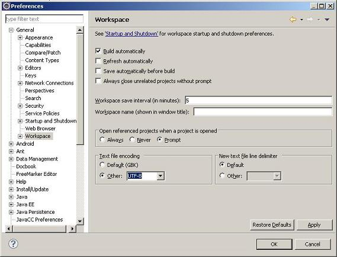
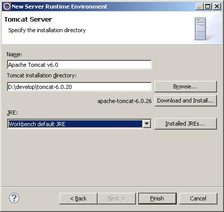
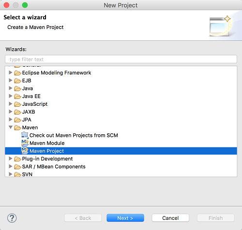
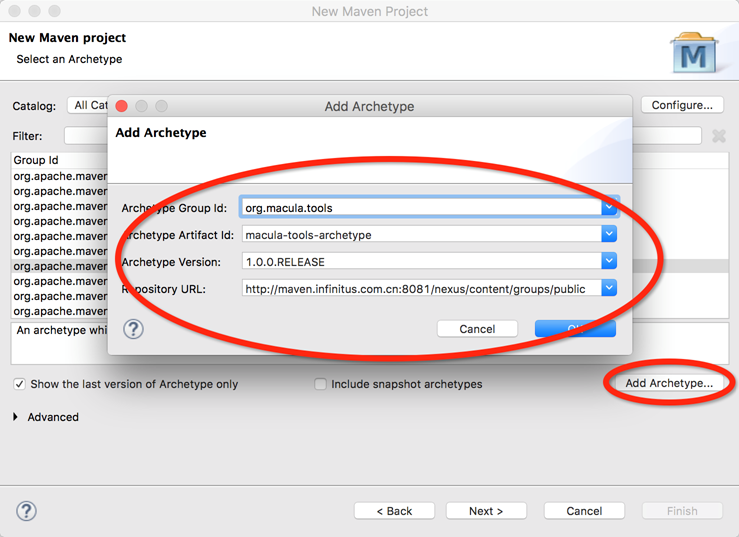
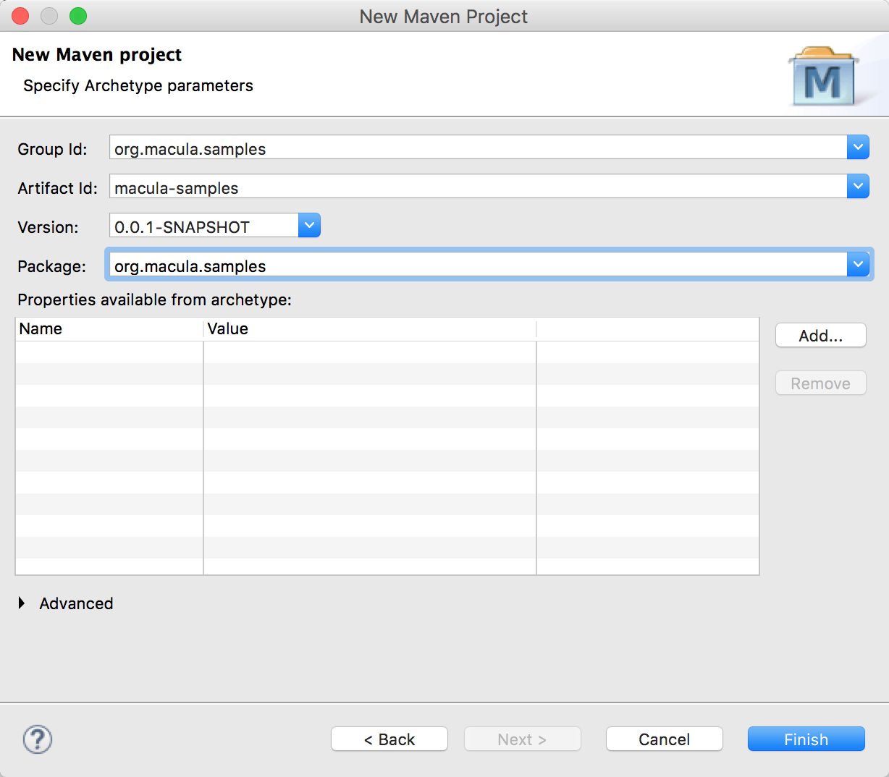
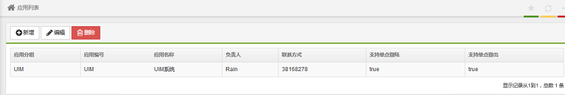
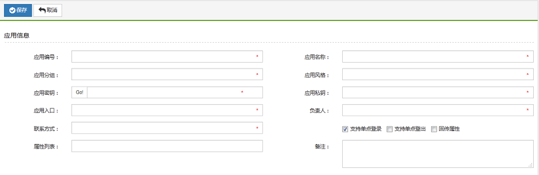
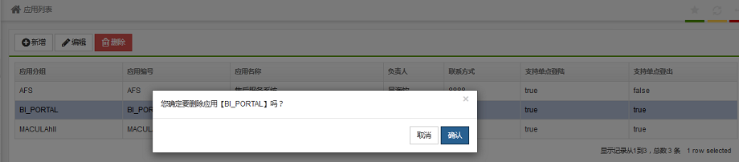

# 快速开始

本章将通过macula-samples的创建过程介绍通过Macula平台开发业务系统的整个过程，对于其中的部分代码内容，将不做过多介绍。

## 环境准备

“工欲善其事，必先利其器”，在开始介绍之前，我们需要准备相应的环境。

*   **Java SDK**

    Macula平台要求使用Java SDK的版本为1.6以上。
    
*   **Tomcat**

    选择Tomcat6.0以上版本。
    
*   **Eclipse**

    可选择最新的Eclipse 3.6.2版本，在Eclipse的多个发布版本中，选择Eclipse IDE for Java EE Developers，该版本包含了可部署的J2EE服务器适配。
    
*   **Maven-Eclipse插件**

    Maven插件： http://download.eclipse.org/technology/m2e/releases
    
    Maven-Wtp插件：在安装了上面的插件后，在Preference->Maven ->Discovery中，选择WTP插件安装。
    
*   **svn-Eclipse插件**

    SVN插件：http://subclipse.tigris.org/update_1.6.x/
    
*   **数据库（Oracle）**

    准备运行时需要的数据库资源。
    
另外，为了方便开发Freemarker模版等，可加入Freemarker IDE插件等，为了增强代码的健壮性，可加入FindBugs、CheckStyle等Eclipse插件。

## 环境配置

* **文件编码设置**

    Macula平台要求使用UTF-8的文件编码格式，可通过Eclipse -> Preference -> General -> Workspace 中，设定Text file encoding的方式设置项目环境为UTF-8编码。
    
    
    
* **服务器设置**

    业务系统最终需要在J2EE容器中运行，这里选择Tomcat6.0作为服务器容器，在Eclipse中，需要进行相关配置。

    通过Eclipse -> Preference -> Server -> Runtime Envionment选取增加Apache Tomcat6.0服务：   
    
    
    
    
    
    
## 项目的创建

Macula框架现在提供了一个创建我们所定义项目的maven插件，具体使用方式如下：
 
在eclipse中选择创建Maven Project



点击下一步后按照下面界面安装macula-tools-archetype插件（如果已经存在无需再次安装）



继续点击下一步如下图输入你项目的Group Id、Artifact Id、Version和Package:



后面按照界面提示操作，即可生成整个项目的结构。然后在eclipse中右键选择Maven->Update Project。

## 运行

运行上述项目需要按照以下步骤准备：

* 安装mysql和redis
* 需要提供一个mysql数据库，创建好macula3和macula-samples，注意修改mysql数据库的相关连接信息
* 注意修改redis连接的相关信息
* 以上配置保存在applicationContext-root.xml中，可以根据需要修改
* CustomMyUserLoginRepopsitory类需要关注，根据你的用户表获取用户信息构造凭据
* 如果你要改变登录、菜单等信息，可以关注CustomMyAppController类
* 删除macula-samples-parent/pom.xml文件中parent的部分
* 启动运行

本程序中的演示程序URL是

http://localhost:8080/macula-samples-webapp/admin/demo/application/list

为了可以访问上述地址，你需要配置菜单、功能并做相应的授权

默认登录地址是

http://localhost:8080/macula-samples-webapp/login?form=true

默认登录用户是 admin,密码是infi123*

后端应用地址：http://localhost:8080/macula-samples-webapp/admin

前端应用地址：http://localhost:8080/macula-samples-webapp/front

## 打包

通过maven命令，mvn package可实现打包，如果需要发布到仓库中，可使用mvn install命令。

## 程序开发
### 概要介绍

Macula 框架使用了 Spring，JPA（Hibernate），JQuery和KnockoutJS 等关键技术，所以要想熟练掌握框架，需要对这些技术很熟悉。一般做过 Java 开发的对 Spring 和 JPA（Hibernate） 都会有些了解，但对 JQuery 和 KnockoutJS 可能了解不多，特别是 KnockoutJS。所以有必要加强对 JQuery 和 KnockoutJS 的学习。 下面列举了 JQuery 和 KnockoutJS 的教程的链接，希望能帮助开发人员快速掌握这两种技术。

JQuery 教程

http://docs.jquery.com/Tutorials

KnockoutJS 教程

http://learn.knockoutjs.com/

该教程是假设开发人员已经获取到 Macula 平台的代码，并且配置好了 Eclipse 开发环境。下面我们以一个示例一步步详细解释整个开发过程。我们要实现一个“应用管理”的功能，用于在我们的系统中保存应用的相关信息。我们需要提供新增、编辑、删除功能，以及一个列表功能来显示当前所有的应用信息。

### Domain 和 Repository 层

首先，我们需要一个 Domain 类用于存放应用信息，然后还需要相对应的Repository类来对应用信息进行增删改查等操作。Macula 平台的 Repository 层基于 Spring-Data-JPA（hibernate） 做了一些封装，功能很全面，只要在指定 package 下定义好 domain model 和 Repository 接口，就可以实现很完善的数据存储功能。

#### Domain 定义

业务系统中，Domain可以接口与实现使用相同的类，简化开发的工作量，在实现类中通过 annotation 加上数据库表和字段的定义。 Domain 类放在 macula-xxx-repository 资源包里（如macula-samples-repository），对应的 package 是类似这样：

```
org.macula.samples.macula_samples.domain;
```

类的示例：

```java
@Entity
@DynamicInsert
@DynamicUpdate
@Table(name = "DEMO_APPLICATION")
@Auditable
public class DemoApplication extends AbstractAuditable<Long> {

	private static final long serialVersionUID = 1L;

	@Column(name = "APP_ID", nullable = false, unique = true, length = 50)
	@NotNull
	@Length2(min = 1, max = 50)
	private String appId;
	@Column(name = "APP_NAME", nullable = false, length = 50)
	@NotNull
	@Length2(min = 1, max = 50)
	private String name;
	@Column(name = "APP_GROUP", nullable = false, length = 50)
	@NotNull
	@Length2(min = 1, max = 50)
	private String appGroup;
	@Column(name = "SECURE_KEY", nullable = false, length = 1024)
	@NotNull
	@Length2(min = 1, max = 1024)
	private String secureKey;
	@Column(name = "PRIVATE_KEY", nullable = false, length = 1024)
	@NotNull
	@Length2(min = 1, max = 1024)
	private String privateKey;
	@Column(name = "HOME_PAGE", nullable = false, length = 255)
	@NotNull
	@Length2(min = 1, max = 255)
	private String homepage;

	@Column(name = "SUPERVISOR", length = 255)
	@Length2(min = 0, max = 255)
	private String supervisor;

	@Column(name = "CONTACT", length = 255)
	@Length2(min = 0, max = 255)
	private String contact;

	@Column(name = "COMMENTS", length = 255)
	@Length2(min = 0, max = 255)
	private String comments;

	@Column(name = "THEME", length = 50)
	@Length2(min = 0, max = 50)
	private String theme;

	@Column(name = "IS_SSIN", nullable = false)
	private boolean singleSignOn;
	@Column(name = "IS_SSOUT", nullable = false)
	private boolean singleSignOut;

	@Column(name = "USE_ATTRS", nullable = false)
	private boolean useAttributes;

	@Column(name = "ALLOWED_ATTRS")
	private String allowedAttributes;

	//getters and setters
}
```

然后，通过在 EntityManagerFactory 的定义中加入 Domain 所在的包后，Macula 平台可以自动扫描这些 Domain 定义，如下面示例代码①处所示。

```xml
	<bean id="entityManagerFactory_macula-samples" parent="abstractEntityManagerFactory">
		<property name="persistenceUnitManager">
			<bean class="org.springframework.orm.jpa.persistenceunit.DefaultPersistenceUnitManager">
				<property name="defaultPersistenceUnitName">
					<value>macula-samples</value>
				</property>
				<property name="defaultDataSource" ref="macula-samples_dataSource" />
				<property name="packagesToScan">
					<array>
					   <!-- ① -->
                     <value>org.macula.samples.macula_samples.domain</value>
					</array>
				</property>
			</bean>
		</property>
	</bean>
```


#### Repository 定义

Repository 相当于 DAO 层，通过操作 Domain 存取数据。

Repository 一般只需要增加一个接口类，并且继承 MaculaJpaRepository 就可以，Macula 平台可以在运行环境中自动产生实现类，并实现常用的 DAO 操作。

Repository 接口的示例如下：

```java
public interface DemoApplicationRepository extends MaculaJpaRepository<DemoApplication, Long> {

	DemoApplication findByAppId(String appId);

	List<DemoApplication> findByAppGroup(String appGroup);

}
```

### 列表功能

下面我们先来实现列表功能。

列表页面如下图所示： 



下面我们来说明这个功能的实现。

#### 页面部分
列表页面主要分为2个部分，第一部分是上面的功能按钮部分，第二部分是数据列表显示部分。

整个页面的结构是这样的：

```html
<@layout.mower_admin title="应用列表" scripts="admin/macula-base/datasource/list_mower.js"
version="[$Revision: 4511 $]" require="knockoutjs">
	<#assign code="datasource-list" />
	<@ui.panel>
		<@ui.panel_head>
			<div class="col-xs-12 col-md-12">
				功能按钮部分
			</div>
		</@ui.panel_head>
		<@ui.panel_body>
				列表显示部分
		</@ui.panel_body>
	</@ui.panel>
</@layout.mower_admin>
```

示例如下：

```html
<@layout.mower_admin title="应用列表" scripts="admin/demo/application/list.js" version="[$Revision: 4511 $]" require="knockoutjs">
	<#assign code="application-list" />
	<@ui.panel>
		<@ui.panel_head>
			<div class="col-xs-12 col-md-12">
				<a id="add-action-${code}" class="btn btn-default" data-toggle="pushBreadcrumb" data-label="新增" data-page="admin/demo/application/create">
				    <i class="fa fa-plus-circle fa-lg"></i>
				    新增
				</a>
				<a id="edit-action-${code}" class="btn btn-default" data-label="编辑">
				    <i class="fa fa-pencil fa-lg"></i>
				    编辑
				</a>
				<a id="delete-action-${code}" class="btn btn-danger">
				    <i class="fa fa-trash-o fa-lg"></i>
				    删除
				</a>
			</div>
		</@ui.panel_head>
		<@ui.panel_body>
			<table id="list-${code}" class="table table-striped table-bordered table-hover" width="100%"
			 data-serverSide="true" 
			 data-paging="false" 
			 data-ordering="false" 
			 data-ajax-url="${base}/admin/demo/application/apps"
			 data-ajax-type="get"
			 data-select="true"
			 data-row-id="id"
			 rel="datatables">
			    <thead>
			        <tr>
			            <th data-name="appGroup">应用分组</th>
			            <th data-name="appId">应用编号</th>
			            <th data-name="name">应用名称</th>
			            <th data-name="supervisor">负责人</th>
			            <th data-name="contact">联系方式</th>
			            <th data-name="singleSignOn">支持单点登陆</th>
			            <th data-name="singleSignOut">支持单点登出</th>
			        </tr>
			    </thead>
			</table>
		</@ui.panel_body>
	</@ui.panel>
</@layout.mower_admin>
```

页面部分用到了 JQuery 和 KnockoutJS 技术。下面从功能按钮部分开始，详细讲解一下相关内容。

功能按钮部分

看一下新增按钮在页面中的定义：

```html
<a id="add-action-${code}" class="btn btn-default"
data-toggle="pushBreadcrumb" data-label="新增"
data-page="admin/demo/application/create">
	<i class="fa fa-plus-circle fa-lg"></i>
	新增
</a>
```

这个按钮是显示新增的界面，里面没有太多处理，主要需要注意 `data-toggle` 和 `data-page`的定义。`data-toggle="pushBreadcrumb"` 用于更新面包屑；`data-page`用于指定要显示的新页面的 url。

再看一下编辑按钮，编辑按钮是在列表中选中一条记录后点击来修改记录。

```html
<a id="edit-action-${code}" class="btn btn-default" data-label="编辑">
	<i class="fa fa-pencil fa-lg"></i>
	编辑
</a>
```

这里我们直接用 JQuery 为这个按钮的 click 事件绑定了方法。这个方法里先获取被选取记录的行 id，然后触发 pushBreadcrumb 事件，并转到编辑页面。对应绑定方法的定义在 .js 文件中，代码如下：

```javascript
// 编辑按钮
var _onEditAction = function() {
	$('#edit-action-' + code).click(function(e) {
	    var ids = $(table).DataTable().selectedRowIds();
	    if (ids.length > 0) {
		    $(this).trigger({
		    	type :'push.mu.breadcrumb',
		    	page : base + '/admin/demo/application/edit/' + ids[0]
		    })
	    } else {
	       MessageBox.error('请选择一条记录编辑.');
	    }
	});
};
```

数据列表显示部分

这部分主要是定义表格结构和要显示的数据内容，采用了 datatables 插件。定义表格结构示例如下：

```html
<table id="list-${code}" class="table table-striped table-bordered table-hover" width="100%"
	data-serverSide="true" 
	data-paging="false" 
	data-ordering="false" 
	data-ajax-url="${base}/admin/demo/application/apps"
	data-ajax-type="get"
	data-select="true"
	data-row-id="id"
	rel="datatables">
	 <thead>
		<tr>
			<th data-name="appGroup">应用分组</th>
			<th data-name="appId">应用编号</th>
			<th data-name="name">应用名称</th>
			<th data-name="supervisor">负责人</th>
			<th data-name="contact">联系方式</th>
			<th data-name="singleSignOn">支持单点登陆</th>
			<th data-name="singleSignOut">支持单点登出</th>
		</tr>
	</thead>
</table>
```
其中，`data-serverSide`指明数据是否从服务器端获取；`data-paging`指明数据是否分页显示；`data-ordering`指明是否对数据排序；`data-ajax-url`指明从服务器端获取数据的URL；`data-ajax-type`指明从服务器端获取数据的请求方式，get或post；`data-select`指明表格中的行是否能被选中；`data-row-id`指明数据中的哪一列做为表格中的行的 id;`rel="datatables"`指明使用 datatables 插件。余下是表格表头的定义，表头中`data-name`的定义需要和服务器端返回的属性名一致。

对于 datatables 的具体使用方法请参考 Macula UI 官方文档的相关部分：[Macula UI 官方文档 datatables 部分](http://macula.top/mower/view.html#datatables)。

#### Service 层

下面我们来看 Service 层的实现。Service 类放在 macula-xxx-service 资源包里（如macula-samples-service）。Service 类一般是先定义 Service 接口类，然后定义 Service 实现类。
注意要在 Service 实现类声明上面加上 annotation @Service，我们使用 @Autowired 完成 Repository 实例的注入，对于涉及到数据库修改的实现，需要加上 @Transactional。示例如下：

接口示例:
```java
public interface DemoApplicationService {

	/**
	 * 获取所有的应用列表
	 * 
	 * @return
	 */
	//①
	List<DemoApplication> getAllApplications();

	/**
	 * 按应用名称获取指定的Application
	 * 
	 * @param name
	 * @return
	 */
	DemoApplication findApplicationByAppId(String appId);

	/**
	 * 保存应用
	 * 
	 * @param application
	 * @return
	 */
	Long saveApplication(DemoApplication application);

	/**
	 * 删除应用
	 * 
	 * @param application
	 */
	void deleteApplication(DemoApplication application);

}
```
在列表功能中我们需要 Service 层提供一个方法用于获取所有的应用列表。我们先在 DemoApplicationService 这个接口中声明这个方法 #getAllApplications()，如代码中①处所示。


实现类示例:

```java
@Service
public class DemoApplicationServiceImpl implements DemoApplicationService {

	@Autowired
	private DemoApplicationRepository demoApplicationRepository;

	@Override
	//①
	public List<DemoApplication> getAllApplications() {
		List<DemoApplication> result = new ArrayList<DemoApplication>(demoApplicationRepository.findAll());
		return result;
	}

	@Override
	public DemoApplication findApplicationByAppId(String appId) {
		return demoApplicationRepository.findByAppId(appId);
	}

	@Override
	@Transactional
	public Long saveApplication(DemoApplication application) {
		application.updateApplicationInstances();
		Long id = demoApplicationRepository.save(application).getId();
		return id;
	}

	@Override
	@Transactional
	public void deleteApplication(DemoApplication application) {
		demoApplicationRepository.delete(application);
	}

}

```
我们在 DemoApplicationServiceImpl 实现类中提供了 #getAllApplications() 方法的实现，如代码中①处所示。

#### Controller 层

Controller 要选择专门存放 Controller 类的 package 下，比如 org.macula.samples.macula_samples.admin.demo.controller。

先来看我们的示例：

```java
@Controller //①
public class DempApplicationController extends DemoBaseController {
	//②
	@Autowired
	private DemoApplicationService demoApplicationService;

    //③
	@RequestMapping(value = "/application/list", method = RequestMethod.GET)
	public String list(HttpServletRequest request) {
		return super.getRelativePath("/application/list");
	}

    //④
	@RequestMapping(value = "/application/apps", method = RequestMethod.GET)
	@OpenApi
	public Page<DemoApplication> getApplications() {
		return new PageImpl<DemoApplication>(demoApplicationService.getAllApplications());
	}

	@RequestMapping(value = "/application/edit/{id}", method = RequestMethod.GET)
	public String edit(@PathVariable("id") Long id, Model model, HttpServletRequest request) {
		model.addAttribute("id", id);
		return super.getRelativePath("/application/edit");
	}

	@RequestMapping(value = "/application/create", method = RequestMethod.GET)
	public String create() {
		return super.getRelativePath("/application/edit");
	}

	@RequestMapping(value = "/application/app/{id}", method = RequestMethod.GET)
	@OpenApi
	public DemoApplication getApplication(@PathVariable("id") DemoApplication application) {
		if (application == null) {
			application = new DemoApplication();
			application.setSingleSignOn(true);
			application.setAppInstances(new ArrayList<DemoApplicationInstance>());
		}
		return application;
	}

	@RequestMapping(value = "/application/save", method = RequestMethod.POST)
	@OpenApi
	public Long save(@FormBean("application") @Valid DemoApplication application) {
		if (hasErrors()) {
			throw new FormBindException(getMergedBindingResults());
		}
		return demoApplicationService.saveApplication(application);
	}

	@RequestMapping(value = "/application/delete/{id}", method = RequestMethod.POST)
	@OpenApi
	public Long delete(@PathVariable("id") DemoApplication application) {
		demoApplicationService.deleteApplication(application);
		return application.getId();
	}

}
```

关于上面的示例，有几点需要说明：

1. Controller类声明上面加上 annotation          @Controller，如代码中①处所示，这个很重要，是让我们框架能自动识别这个类是 Controller     类，如果不加就会出问题。

    这部分自动扫描 Controller 的配置是在各资源包的这个文件中

    src/main/resources/META-INF/spring/macula-xxx-servlet.xml

    里面有一行：

    ```java
    <context:component-scan base-package="org.macula.samples.macula_samples.admin.**.controller" />
    ```
    用来设置需要扫描哪些 package。
    
2.  代码中②处我们看到，我们通过 @Autowired 注解来实现 DemoApplicationService 的自动注入。
3.  我们使用 @RequestMapping 注解来实现URL映射。在页面示例中，我们需要获得所有应用实例的信息，我们的相对URL为 /application/apps ，因此调用到的方法为 #getApplications()。如代码中④中所示。
4.  你可能已经留意到在 #getApplications() 方法上有一个 @OpenApi 的注解。由于我们的列表页面表格中的内容是通过 AJAX JSON 方式获取的，因此我们使用 @OpenApi 直接返回 pojo bean。有关 @OpenApi 的详细介绍，请参阅核心技术中的相关介绍。  

到此，我们的列表功能就完成了。大致上就是我们在页面上使用了 datatables 插件通过 AJAX JSON 的方式从后台获取表格内容， Controller 接收到请求后调用 Serivce 中相应的方法， 而 Serivce 通过 Repository 从数据库中获取相关数据。

### 新增及修改功能

新增/修改页面如下：



新增和修改页面一般使用相同的 .ftl 和 .js 文件，通过逻辑判断当前处理的操作是新增还是修改操作。如果新增和修改功能差别很大，就需要考虑分开两个页面。在本例中，我们使用的是同一个页面。

#### 页面部分

新增/修改页面主要分为2个部分，第一部分是上面的功能按钮部分，第二部分是页面内容部分。

整个页面的结构是这样的：

```
<@layout.mower_admin title=title scripts="admin/demo/application/edit.js" version="[$Revision: 4511 $]" require="knockoutjs">
	<#assign code="edit-application" />
		<@ui.panel>
			<@ui.panel_head>
				功能按钮部分
			</@ui.panel_head>
			<@ui.panel_body>
                页面内容
			</@ui.panel_body>
	</@ui.panel>
</@layout.mower_admin>
```

这个文件是比较容易理解的，首先是定义页面的 title，通过判断一个 id 参数，使用了 freemarker 的标签处理。然后是页面内容，一般都是一个表单，对应着 label 和输入框，示例如下：

```html
<#assign title>
	<#if id?exists>编辑应用<#else>新增应用</#if>
</#assign>

<@layout.mower_admin title=title scripts="admin/demo/application/edit.js" version="[$Revision: 4511 $]" require="knockoutjs">
	<#assign code="edit-application" />
		<@ui.panel>
			<@ui.panel_head>
				<div class="col-xs-12 col-md-12">
				    <a id="save-action-${code}" class="btn btn-primary">
				        <i class="fa fa-check-circle fa-lg"></i>
				        保存
				    </a>
				    <a id="cancel-action-${code}" class="btn btn-default" data-toggle="popBreadcrumb">
				        <i class="fa fa-reply fa-lg"></i>
				        取消
				    </a>
				</div>
			</@ui.panel_head>
			<@ui.panel_body>
		        <form id="form-${code}" item-id="${id?if_exists}" action="${base}/admin/demo/application/save" method="post" class="form-horizontal" rel="validate-form" data-bv-container="tooltip">
		        	<input type="hidden" name="application.id" data-bind="value: id" />
		            <div class="form-body">
		            	<h3 class="form-section">应用信息</h3>
		                <div class="row">
	                        <div class="col-md-6">
	                            <div class="form-group">
	                                <label class="control-label col-md-3">应用编号：</label>
	                                <div class="col-md-9">
	                                    <!-- ① -->
	                                    <input type="text"  name="application.appId" data-bind="value: appId" class="form-control input-sm" required maxlength="50" <#if id?exists>readOnly</#if> />
	                                </div>
	                            </div>
	                        </div>
	                        <div class="col-md-6">
	                            <div class="form-group">
	                                <label class="control-label col-md-3">应用名称：</label>
	                                <div class="col-md-9">
	                                    <input type="text"  name="application.name" data-bind="value: name"  class="form-control input-sm" required maxlength="50"/>
	                                </div>
	                            </div>
	                        </div>
		                </div>
		                <div class="row">
	                        <div class="col-md-6">
	                            <div class="form-group">
	                                <label class="control-label col-md-3">应用分组：</label>
	                                <div class="col-md-9">
	                                    <input type="text"  name="application.appGroup" data-bind="value: appGroup" class="form-control input-sm" required maxlength="50"/>
	                                </div>
	                            </div>
	                        </div>
	                        <div class="col-md-6">
	                            <div class="form-group">
	                                <label class="control-label col-md-3">应用风格：</label>
	                                <div class="col-md-9">
	                                    <input type="text"  name="application.theme" data-bind="value: theme"  class="form-control input-sm" required maxlength="50" />
	                                </div>
	                            </div>
	                        </div>
	                    </div>
	                    <div class="row">
	                        <div class="col-md-6">
	                            <div class="form-group">
	                                <label class="control-label col-md-3">应用密钥：</label>
	                                <div class="col-md-9">
										<div class="input-group input-group-sm">
											<span class="input-group-btn">
												<button id="gen-key-action" class="btn btn-default" type="button">Go!</button>
											</span>		                                
											<input type="text"  name="application.secureKey" data-bind="value: secureKey" class="form-control input-sm" required maxlength="1024"/>
										</div>						
									</div>
	                            </div>
	                        </div>
	                        <div class="col-md-6">
	                            <div class="form-group">
	                                <label class="control-label col-md-3">应用私钥：</label>
	                                <div class="col-md-9">
	                                    <input type="text"  name="application.privateKey" data-bind="value: privateKey"  class="form-control input-sm" required  maxlength="1024" />
	                                </div>
	                            </div>
	                        </div>
	                    </div>
	                    <div class="row">
	                        <div class="col-md-6">
	                            <div class="form-group">
	                                <label class="control-label col-md-3">应用入口：</label>
	                                <div class="col-md-9">
	                                    <input type="text"  name="application.homepage" data-bind="value: homepage" class="form-control input-sm" required  maxlength="1024"/>
	                                </div>
	                            </div>
	                        </div>
	                        <div class="col-md-6">
	                            <div class="form-group">
	                                <label class="control-label col-md-3">负责人：</label>
	                                <div class="col-md-9">
	                                    <input type="text"  name="application.supervisor" data-bind="value: supervisor" class="form-control input-sm" required  maxlength="255"/>
	                                </div>
	                            </div>
	                        </div>
	                    </div>
	                    <div class="row">
	                        <div class="col-md-6">
	                            <div class="form-group">
	                                <label class="control-label col-md-3">联系方式：</label>
	                                <div class="col-md-9">
	                                    <input type="text"  name="application.contact" data-bind="value: contact"  class="form-control input-sm" required maxlength="255" />
	                                </div>
	                            </div>
	                        </div>
	                        <div class="col-md-6">
	                            <div class="form-group">
	                                <label class="control-label col-md-3"></label>
	                                <div class="col-md-9">
	                        			<label class="checkbox-inline">
			                        	    <input type="hidden" name="application.singleSignOn" data-bind="value: singleSignOn, type: 'boolean' " />
			                        	    <input type="checkbox" data-bind="checked: singleSignOn" />
											支持单点登录
		                        	    </label>
	                        			<label class="checkbox-inline">
			                        	    <input type="hidden" name="application.singleSignOut" data-bind="value: singleSignOut, type: 'boolean' " />
			                        	    <input type="checkbox" data-bind="checked: singleSignOut" />
											支持单点登出
		                        	    </label>
	                        			<label class="checkbox-inline">
			                        	    <input type="hidden" name="application.useAttributes" data-bind="value: useAttributes, type: 'boolean' " />
			                        	    <input type="checkbox" data-bind="checked: useAttributes" />
											回传属性
		                        	    </label>
	                        		</div>
	                        	</div>
	                        </div>
	                    </div>
	                    <div class="row">
		                    <div class="col-md-6">
		                        <div class="form-group">
		                        	<label class="control-label col-md-3">属性列表：</label>
		                            <div class="col-md-9">
		                            	<input type="text"  name="application.allowedAttributes" data-bind="value: allowedAttributes" class="form-control input-sm" maxlength="1024"/>
		                            </div>
		                        </div>
		                    </div>
							<div class="col-md-6">
		                        <div class="form-group">
		                            <label class="control-label col-md-3">备注：</label>
		                            <div class="col-md-9">
		                                <textarea type="text"  name="application.comments" data-bind="value: comments" rows="2"  class="form-control input-sm">
										</textarea>
		                            </div>
		                        </div>
		                    </div>
						</div>
		            </div>
		        </form>
			</@ui.panel_body>
	</@ui.panel>
</@layout.mower_admin>
```

里面要注意的是对于输入框的定义，有个数据绑定（data-bind）的处理, 如①处所示，我们在下面 edit.js 里会说明。

edit.js 主要是完成2项工作：

1. 通过 Ajax 读取服务器端的数据,构造跟 edit.ftl 页面里对应的 model
2. 绑定 edit.ftl 页面里对应的按钮操作

代码如下：

```javascript

var ApplicationForm = (function($) {
	var code = 'edit-application', parentCode = 'application-list', $form = $('#form-' + code);

	var viewModel = function(data) {
		var self = this;
		ko.mapping.fromJS(data, {}, self);
	};

	return {
		init : function() {
			// 初始化界面数据
			//①
			var currentId = $form.attr('item-id');
			if (!currentId) {
				// -1 means server return add object struct
				currentId = -1;
			}
			
			//②
			$.getJSON(base + '/admin/demo/application/app/' + currentId, function(data) {
				ko.applyBindings(new viewModel(data.returnObject), $form[0]);
			});
			
		    //③
			// 绑定按钮事件
			$('#save-action-' + code).click(function(e) {
				var that = $(this);
				$form.ajaxValidSubmit({
					success : function(data) {
						MessageBox.success('保存成功');
						that.trigger('pop.mu.breadcrumb');
						$('#list-' + parentCode).DataTable().ajax.reload();
					},
					error : function() {
					}
				});
			});

		}
	};
}(jQuery));

$(function() {
	ApplicationForm.init();
});

```

关于以上代码，我们有几点要说明一下：

1. 在①处，我们先判断 item-id 在页面中是否存在。如果存在，我们认为是编辑页面，我们会根据这个item-id 通过 AJAX 方式从后台获得这个应用的相关信息在页面进行填充；否则，我们认为这是个新增页面，令 item-id 等于-1, 这样从后台返回一个新的空白对象对页面进行填充。
2. 在②处，我们通过 AJAX 方式从后台获得应用的相关信息或新的空白对象，然后通过 knockoutJS 绑定页面的元素中。
3. 在③处，我们为保存按钮绑定 click 事件，通过 AJAX 提交表单。保存成功后，返回列表页面并刷性列表页面中的表格数据。

#### Service 层

这部分内容在前面的列表功能中已经解析过，这里我们直接给出相关代码。

接口示例：
```java 
public interface DemoApplicationService {

	/**
	 * 按应用名称获取指定的Application
	 * 
	 * @param name
	 * @return
	 */
	DemoApplication findApplicationByAppId(String appId);

	/**
	 * 保存应用
	 * 
	 * @param application
	 * @return
	 */
	Long saveApplication(DemoApplication application);

	//... 其它部分省略
}
```

实现类示例：

```java 
@Service
public class DemoApplicationServiceImpl implements DemoApplicationService {

	@Autowired
	private DemoApplicationRepository demoApplicationRepository;

	@Override
	public DemoApplication findApplicationByAppId(String appId) {
		return demoApplicationRepository.findByAppId(appId);
	}

	@Override
	@Transactional
	public Long saveApplication(DemoApplication application) {
		application.updateApplicationInstances();
		Long id = demoApplicationRepository.save(application).getId();
		return id;
	}

	//... 其它部分省略

}
```

#### Controller 层

Controller 层相关代码如下：

```java
@Controller
public class DempApplicationController extends DemoBaseController {
	@Autowired
	private DemoApplicationService demoApplicationService;

    //①
	@RequestMapping(value = "/application/create", method = RequestMethod.GET)
	public String create() {
		return super.getRelativePath("/application/edit");
	}

    //②
	@RequestMapping(value = "/application/app/{id}", method = RequestMethod.GET)
	@OpenApi
	public DemoApplication getApplication(@PathVariable("id") DemoApplication application) {
		if (application == null) {
			application = new DemoApplication();
			application.setSingleSignOn(true);
			application.setAppInstances(new ArrayList<DemoApplicationInstance>());
		}
		return application;
	}

    //③
	@RequestMapping(value = "/application/save", method = RequestMethod.POST)
	@OpenApi
	public Long save(@FormBean("application") @Valid DemoApplication application) {
		if (hasErrors()) {
			throw new FormBindException(getMergedBindingResults());
		}
		return demoApplicationService.saveApplication(application);
	}

	//... 其它部分省略

}
```

以上代码，我们有几点需要说明一下：

1. 在列表页面中，无论我们点击新增或编辑按钮，发出的请求皆为 /application/create ，在Controller处，返回 /application/edit 页面。如代码①处所示。
2. 在②处我们返回应用的信息或一个新的空白对象，用于应答页面发出的 AJAX 请求以填充页面。
3. ③处用于保存应用信息。

### 删除功能

删除功能一般是直接在 list 页面里做的，选中某条记录，然后点击删除按钮，会使用 JQuery 的方式调用服务器端相应的处理，然后根据返回值做结果提示。例如：




#### 页面部分

我们先看一下 list 页面上对于删除功能按钮的定义

```html
<a id="delete-action-${code}" class="btn btn-danger">
    <i class="fa fa-trash-o fa-lg"></i>
	删除
</a>
```

上面代码就定义了点击按钮会触发 onDeleteAction 方法，这个方法是在 list.js 里定义的，代码如下:

```javascript
// 删除按钮
var _oDeleteAction = function() {
    $('#delete-action-' + code).click(function(e) {
	    var row = $(table).DataTable().selectedRows();
	
        if (row && row.length > 0) {
            ModalBox.confirm('您确定要删除应用' + '【' + row[0].appId + '】吗？', function(result) {
            if (result) {
                $.post(base + '/admin/demo/application/delete/' + row[0].id, function(data) {
                    if (data.success) {
                        $(table).DataTable().ajax.reload();
                    } else {
                        AlertBox.error(data.exceptionMessage);
                    }
	           });
	            }
	       });
	   } else {
	       MessageBox.info('请选择一条记录删除.');
	   }
    });
};
```

#### Service 层

这部分内容在前面的列表功能中已经解析过，这里我们直接给出相关代码。

接口示例：

```java
public interface DemoApplicationService {

	/**
	 * 删除应用
	 * 
	 * @param application
	 */
	void deleteApplication(DemoApplication application);
	
	//... 其它部分省略
}
```

实现类示例：

```java
@Service
public class DemoApplicationServiceImpl implements DemoApplicationService {

	@Autowired
	private DemoApplicationRepository demoApplicationRepository;

	@Override
	@Transactional
	public void deleteApplication(DemoApplication application) {
		demoApplicationRepository.delete(application);
	}


	//... 其它部分省略

}
```


#### Contoller 层

Contoller 层相关代码如下：

```java
@Controller
public class DempApplicationController extends DemoBaseController {
	@Autowired
	private DemoApplicationService demoApplicationService;

	@RequestMapping(value = "/application/delete/{id}", method = RequestMethod.POST)
	@OpenApi
	public Long delete(@PathVariable("id") DemoApplication application) {
		demoApplicationService.deleteApplication(application);
		return application.getId();
	}

	//... 其它部分省略

}
```
