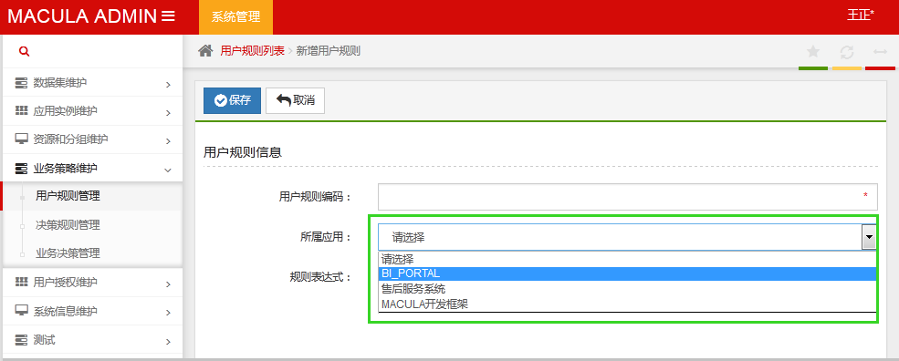

### 展示层

在Macula开发平台下，建议使用Spring MVC + Freemarker的方式来实现展现层。

同时对于Ajax部分，在javascript框架中建议使用jquery框架。

## Controller编写

### 使用基类Controller

在展示层编写的Controller实现，需要直接或间接扩展至BaseController

```java
@RequestMapping("admin/macula-base")
public class AdminMaculaBaseController extends BaseController {
    //something
}
```

在BaseController中处理了大量的异常处理方式以及数据返回要求的设定。

### 表单校验

在Controller中的参数中，使用@FormBean注解来绑定页面数据到Domain，如果转换失败，则失败结果会出现在BindingResult中

在Controller中的参数中，使用@Valid注解来检查页面数据到Domain数据是否符合校验规则，校验规则的定义是在Domain中完成的，采用JSR-303的Bean Validator标准定义。校验失败的结果同样保存在BindingResult中

失败结果可以通过BaseController中的getMergedBindingResults方法得到，具体使用请参考BaseController类的使用说明。

### 参数绑定校验

在Spring MVC默认的基础上，Macula开发平台在参数绑定上做了适当扩展，以适应与Struts（Webwork）等相同的对参数处理的一致性，具体来说，有如下的变化：

1. Bean参数绑定

   默认情况下，String MVC对参数的绑定方式，采用直接属性名与给定POJO属性名相同的方式实现绑定，为了更好的区分具体的参数信息，Macula平台扩展了这类绑定，允许

   ```
   pojo名+ . + 属性名
   ```

   的方式绑定。

   **例 1. 两种绑定的区别**

   比如在Controller中，会传入用户信息保存，其Controller原型为：

   ```java
   public User save(User user) {
       // something
       return user;
   }
   ```

   此时客户端提交的参数信息为：

   ```
   ?userName=Wilson&password=123456
   ```

   此时Spring自动将userName和password绑定生成User对象。但这种方式在返回多个对象时不太适用，所以Macula平台通过扩展，可通过修改Controller中的原型为：

   ```java
   public User save(@Valid @FormBean("user") User user){
      if (hasErrors()) {
         throw new FormBindException(getMergedBindingResults());
      }

      // something
      return user;
   }
   ```

   通过Macula平台扩展后的提交的数据格式，将可以通过下面提交方式绑定：

   ```
   ?user.userName=Wilson&user.password=123456
   ```

   为实现这个扩展，主要在于applicationContext-mvc.xml文件中的BeanArgumentResolver定义：

   ```xml
   <bean class="org.springframework.web.servlet.mvc.annotation.AnnotationMethodHandlerAdapter">
      <property name="customArgumentResolvers">
          <list>
              <bean class="org.macula.core.mvc.FormBeanArgumentResolver">
                  <property name="webBindingInitializer" ref="webBindingInitializer" />
              </bean>
          </list>
      </property>
   </bean>
   ```

   通过对自定义参数的解析，可以实现上述的变化。

   _**重要**_

   _需要注意的是，使用Macula平台的绑定方式的前提是：必须使用@FormBean前缀，并且不能使用诸如@ModelAttribute、@RequestBody等Spring的绑定注解。_

2. FormBean的表单防重复提交

   在Form提交时，为了防止用户对表单的重复提交，除了使用客户端脚本控制按钮的状态外，平台提供了防重复提交的解决方案。

   一般情况下，防重复提交有2个应用场景：**1\)防止用户无意识的重复提交；2\)防止用户恶意的重复提交。**

   对于无意识的提交，只需要在页面隐藏一个唯一性的Token，在表单提交时返回，在服务端校验并销毁即可完成对Token的验证而阻止该提交。

   对于用户可能存在的恶意提交，可通过在表单提交时，插入验证码的方式来进行，用户必须正确输入了验证码，并在服务端校验成功后，才能进行业务逻辑的处理。

   在平台实现的方式上，采用在FormBean注解中加入属性：

   valid：\(boolean\)是否需要检测重复提交；

   token：\(String\)在表单页面中提交的参数名称，默认值为ftoken，除非与业务中的字段冲突，否则不需要设置为其他值；

   captcha：\(boolean\)是否检测验证码，来防止恶意提交

   整个校验过程由FormBeanArgumentResolver完成。

   相应的，在界面层面，需要配合在表单中加入防重复提交信息，在macula.ftl中提供了freemarker宏的默认实现。在该默认实现情况下，可通过在表单位置加入&lt;@macula.formToken /&gt;即可，对于需要加入校验码的情况下，使用&lt;@macula.formToken captcha=true /&gt;

   具体的实现可参考macula.ftl文件。

   _**重要**_

   _主要注意在同一个RequestMapping的方法中，如果有多个通过@FormBean注释的参数，在第一个使用FormBean注释的参数中加入该特性即可，其他不要加。  
   特别地，加入了自动控制防重复提交后，生成的客户端token只能进行一次校验即失效，所以在提交后，如果表单需要再次提交，需要更新隐藏的token的值。在默认情况下，调用$\(form\).trigger\('changeCaptcha'\)即可更新，如果需要定制，可参考macula.ftl中的实现，做自定义的宏来处理。_

3. Pageable参数绑定

   在使用了Spring-Data框架够，对于多数分页式查询，可通过直接传入Pageable参数和额外的参数条件，即可返回包括总记录数、当前页面记录等信息的Page对象返回，对于Controller层，方便的获得页面传递的Pageable参数并构造成相应的对象值，也是一种代码简洁和易用性上的提升。

   对于Pageable参数的绑定，比如Controller中编写：

   ```java
   @RequestMapping(value = "/test/user/list", method = RequestMethod.GET)
   public Page<User> list(Pageable pageable) {
       Page<User> page = userRespository.findAll(pageable);
       // other coding...
       return page;
   }
   ```

   为了实现这个扩展，主要在applicationContext-mvc.xml文件中的PageableArgumentResolver定义：

   ```xml
   <bean class="org.springframework.web.servlet.mvc.annotation.AnnotationMethodHandlerAdapter">
      <property name="messageConverters" ref="messageConverters" />
      <property name="webBindingInitializer" ref="webBindingInitializer" />
      <property name="customArgumentResolvers">
         <list>
             <bean class="org.macula.core.mvc.PageableArgumentResolver" />           
         </list>
      </property>
   </bean>
   ```

   Pageable参数绑定时，将直接从Request参数中获取，如果在一个方法中，需要构建多个Pageable对象，可通过@Qualifier来指定别名，这样在Request中获取属性 别名+ "\_" + 属性名，来构建Pageable对象。

   request参数包括：page\(页码\)、rows\(每页行数\)、sort\(按什么排序\)、order（ASC升序，DESC降序\)

   _**重要**_

   _这里Pageable与Bean构建的区别在于，默认情况下Pageable直接从Request中获取数据，而在通过@Qualifier指定别名时，Bean的属性获取规则是 别名+ "." + 属性名，而Pageable的规则是 别名+ "\__" +属性名。

4. 类型转换

   很多情况下，在编辑时或者在查看详细信息时，总是通过传入一个主键值（通常是Long型），来获取具体的记录信息，在Macula平台中，为了简化这种操作，对于已定义的Domain类，可以通过已定义的ConversionService直接转换。

   对应的applicationContext-mvc.xml中配置如下：

   ```xml
   <bean id="conversionService" class="org.springframework.format.support.FormattingConversionServiceFactoryBean">
      <property name="converters">
          <list>
              <bean class="org.macula.core.mvc.RepositoryConverter" />
          </list>
      </property>
   </bean>
   ```

   配置该转化后，需要转化的类型必须实现Persistable接口，并且定义了相对应的JpaRepository，否则也不能正常转换。

   _**重要**_

   _除了加入该ConversionService外，还需要注意：_

   * _普通的VO对象不要实现Persistable接口，即不能使用该转换_
   * _待转化类必须实现Persistable接口_
   * _该转换Domain对象，在Spring上下文中，已经定义了相应的JpaRepository Bean，用来通过主键载入该对象值_

     _**例 2. 通过传入主键，直接转化为相应的对象**_

     ```java
     @RequestMapping(value = "/test/user/{userId}/edit", method = RequestMethod.GET)
     public User edit(@PathVariable("userId") User user) {
         return user;
     }
     ```

     如上面的Controller中的定义可见，传入的userId是一个字符串（或者可以认为是Long型），但在edit方法中，可直接定义为User user，即由macula平台实现了对主键到相应Domain实例的转换。

     当然，这里的User对象实现了Persistable接口，并已有相应的UserRepository extends `JpaRepository<User>的实现。`


### ExcelView

为了更好的支持Excel的导出功能，系统提供了ExcelView类结合ExcelUtils的Excel模板方式导出Excel。只要按照ExcelUtils的语法制作Excel模板，然后放在FreeMarker模板文件放置的目录中，在Controller中如下使用：

```java
public ModelAndView excel2() {
    Map<String, Object> model = new HashMap<String, Object>();
    model.put("name", "变量");
    return new ModelAndView(new ExcelView(getRelativePath("/so_master/excel")), model);                   
}
```

上述代码将会去views/admin\[front\]/xxxx/so\_master/目录下寻找excel.xls的Excel模板文件，然后通过ExcelUtils解析该模板文件生成需要的Excel文件。

## Freemarker模板编写

### 页面布局

Macula 使用 FreeMarker 宏来规范ftl页面模板的开发：

* **后端默认布局界面编写**

```
<@layout.mower_admin title="Dashboard">
    具体业务内容
</@layout.mower_admin>
```

* **前端默认界面布局编写：**

```
<@layout.mower_front title="Dashboard">
    <@ui.main_breadcrumb rootType='front' menuCode="FRONT_TEST_MENU1" />
    <@ui.main_wrapper>
        <@ui.main_content>
            Dashborad
        </@ui.main_content>
    </@ui.main_wrapper>
</@layout.mower_front>
```

_**重要**_

布局可以根据是否AJAX请求自动判断是否输出javascript和css的脚本

### 页面布局宏的定义

我们先看看freemarker整个宏文件的定义逻辑：


在views根目录下，有个layout.ftl是整个布局宏的入口：

```
<#macro includeScripts scripts>
    <#if scripts?exists && scripts != ''>
        <#list scripts?split(",") as jsItem>
            <script id="${jsItem?trim?replace('.', '_')?replace('/', '_')}" type="text/javascript">
                <#include "/${jsItem?trim?replace('.js', minVersion+'.js')}" parse=false />
            </script>
        </#list>
    </#if>
</#macro>

<#include "/admin/layout.ftl" />
<#include "/admin/layout_mower.ftl" />
<#include "/front/layout_mower.ftl" />
<#include "/mobile/layout_mower.ftl" />
```

admin目录下，layout.ftl是macula2.0版本的界面布局，layout\_mower.ftl是macula 3.0的布局宏定义，下面讲讲这个文件：

```
<#global resources_admin="${resourceHost!''}/resources/mower/${appVersion!''}/admin" />
<#global views_admin="${resourceHost!''}/views/mower/${appVersion!''}/admin" />

<#macro mower_admin_head title = '' require = ''>
    meta、css等脚本定义        
</#macro>

<#macro mower_admin_header_logo>
    ...
</#macro>

<#macro mower_admin_header_menu>
    ...  
</#macro>

<#macro mower_admin_header_login>
    ...
</#macro>

<#macro mower_admin_footer>
    ...
</#macro>

<#macro mower_admin_scripts require = ''>
    js引入定义
</#macro>

<!--给用户自定义宏的机会 -->
<#include "/admin/app/layout_mower.ftl" />

<#macro mower_admin title scripts = '' version = '' require = ''>
<#global ui_name = 'mower' />
<#global ui_path = 'admin' />
<#if Request['isAjaxRequest']?exists && Request['isAjaxRequest'] == true>
    <#if title?exists><title>${title?if_exists}</title></#if>
    <#if version?exists><meta content="${(version?replace("(\\$)|(\\s\\$)|(Revision:\\s)", "", "r"))?if_exists}-${appVersion!""}"></#if>
    <#nested />
    <@includeScripts scripts />
<#else>
    <!DOCTYPE html>
    <html xmlns="http://www.w3.org/1999/xhtml">
    <head>
        <@mower_admin_head title="${title?if_exists}" require = "${require!''}" />
        <script type="text/javascript">
            ...         
        </script>
    </head>

    <body data-base="${base}">

    <noscript>
        <div class="noscript error">
            您好，要正常运行应用程序，浏览器必须支持Javascript！
        </div>
    </noscript>

    <!-- Loading Container -->
    <div class="loading-container">
       <div class="loader"></div>
    </div>
    <!--  /Loading Container -->    

    <!-- BEGIN HEADER -->
    <div id="header" class="mu-header-container">
        <!-- BEGIN MAIN MENU -->
        <div class="navbar" role="navigation">
            <div class="navbar-inner">
                <div class="navbar-container">
                    <@mower_admin_header_logo />
                    <!-- Sidebar Collapse -->
                    <div class="sidebar-collapse" id="sidebar-collapse">
                        <i class="collapse-icon fa fa-bars"></i>
                    </div>
                    <!-- /Sidebar Collapse -->
                    <@mower_admin_header_menu />
                    <@mower_admin_header_login />
                </div>
            </div>
        </div>
    </div>
    <!-- END HEADER -->

    <!-- BEGIN MAIN -->
    <div class="mu-main-container container-fluid">
        <!-- BEGIN SIDEBAR -->
        <div class="mu-sidebar-wrapper">
            <div class="mu-sidebar" id="sidebar">
                <!-- Page Sidebar Header-->
                <div class="sidebar-header-wrapper">
                    <input type="text" class="searchinput">
                    <i class="searchicon fa fa-search"></i>
                    <div class="searchhelper">搜索菜单</div>
                </div>
                <!-- /Page Sidebar Header -->
                <!-- Sidebar Menu -->
                <ul class="nav sidebar-menu" style="">
                </ul>
                <!-- /Sidebar Menu -->
            </div>
        </div>
        <!-- END SIDEBAR -->    

        <!-- BEGIN CONTENT -->
        <div class="mu-content-wrapper">
            <div class="mu-content">
                <!-- BEGIN BREADCRUMB -->
                <div class="mu-content-header">
                    <div class="mu-breadcrumb-wrapper">
                        <ul class="breadcrumb" data-target="#mainContent">
                            <li data-target="breadcrumb0" class="active"></li>
                        </ul>
                    </div>
                    <div class="header-buttons">
                        <a class="sidebar-toggler" href="#">
                            <i class="fa fa-arrows-h"></i>
                        </a>
                        <a class="refresh" id="refresh-toggler" href="">
                            <i class="glyphicon glyphicon-refresh"></i>
                        </a>
                        <a class="favorite" id="favorite-toggler" href="#">
                            <i class="fa fa-star fa-lg"></i>
                        </a>
                    </div>
                </div>
                <!-- END BREADCRUMB-->
                <div class="mu-content-body">
                    <div class="row">
                        <div class="col-md-12">
                            <div id="mainContent">
                                <div data-panel="breadcrumb0">
                                    <#nested />
                                </div>
                            </div>
                        </div>
                    </div>
                </div>
            </div>
        </div>        
    </div>
    <!-- END MAIN -->

    <!-- BEGIN FOOTER -->
    <div id="footer" class="mu-footer">
        <@mower_admin_footer />
    </div>
    <!-- END FOOTER -->

    <@mower_admin_scripts require = "${require!''}" />

    <!-- BEGIN PAGE LEVEL SCRIPTS -->
    <script type="text/javascript" src="${resources_admin}/app/js/config${minVersion!""}.js"></script>
    <script type="text/javascript" src="${resources_admin}/app/js/app${minVersion!""}.js"></script>

    <@includeScripts scripts="admin/app/layout_mower.js" />
    <@includeScripts scripts="ui/app/ui.js" />
    <@includeScripts scripts />
    <!-- END PAGE LEVEL SCRIPTS -->
    </body>
    </html>
</#if>
</#macro>
```

_**提示**_  
&lt;@layout.mower\_admin title scripts = '页面脚本' version = '' require = 'angularjs/knockoutjs/vue'&gt;

&lt;/@layout.mower\_admin&gt;

* scripts是您的页面对应的脚本，路径以views下面的目录为准

* title 页面标题

* version 页面版本

* require 要引入的MVC JS文件，支持angularjs、knockoutjs、vue


这个宏是业务页面的主要的宏，一般情况下，不要脱离这个宏做页面，这样未来修改时可以整体替换。

### 后端页面布局定制

下面我们以后台管理页面为例进行讲解。后台管理页面布局如下图所示：


由上图可见，Macula 页面由 header，main container 和 footer 三部分组成。其中，header 由 logo，menu 和 login 组成；main container 主要包括 sidebar 和 content 两大部分；footer 构成比较简单。

为了方便大家理解，我们以一个实际的页面为例子说明各个部分。


开发者可以通过修改自己项目中的如下这个文件来自定义自己的 header logo，header menu，header login 和 footer。

app目录中的layout\_mower.ftl文件可以覆盖，同时会重新定义admin/layout\_mower.ftl中的相关宏。

我们来看一下admin/app目录下的这个文件里面的内容：

```
<#--
使用者可以通过覆盖这个文件实现对一些宏的重新定义包括：
-- html head中的内容，包括meta css等
<#macro mower_admin_head title = ''>
-- LOGO
<#macro mower_admin_header_logo>
-- 菜单栏
<#macro mower_admin_header_menu>
-- 登录后提示信息
<#macro mower_admin_header_login>
-- 页脚
<#macro mower_admin_footer>
包含的Javascript(angularjs,knockoutjs,datagrid)
<#macro mower_admin_scripts require = ''>
-->

<#--
局部替换：如果以下变量定义在具体业务模板中，则会覆盖你的layout模板中的定义

<#global mower_admin_scripts_addition>
    加入你自己的javascript库文件
</#global>

<#global mower_admin_head_addition>
    加入你自己的css文件
</#global>
-->
```

由上面的代码可见，我们可以通过修改宏 mower\_admin\_header\_logo 来自定义自己的 header logo；同样道理我们可以通过修改宏 mower\_admin\_header\_menu，mower\_admin\_header\_login，以及 mower\_admin\_footer 来分别定义自己的 header menu，header login 和 footer。

### 前端页面布局定制

与后端定制类似，front/app/layout\_mower.ftl文件提供了前端布局定制功能：

```
<#--
使用者可以通过覆盖这个文件实现对一些宏的重新定义包括：
--html head中的内容，包括css meta等
<#macro mower_front_head title = ''>
--页面的最上端
<#macro mower_front_header_login>
--广告
<#macro mower_front_header_ad>
--LOGO
<#macro mower_front_header_logo>
--菜单栏
<#macro mower_front_header_menu>
--页脚
<#macro mower_front_footer>
--包含的Javascript(angularjs,knockoutjs,datagrid)
<#macro mower_front_scripts require = ''>
-->


<#--
局部替换：如果以下变量定义在具体业务模板中，则会覆盖你的layout模板中的定义

-- 定义最顶的登录状态条最左边显示的文字内容
<#global mower_front_header_login_custom_left>
    文字
</#global>

-- 定义最顶的登录状态条最右边显示的文字内容
<#global mower_front_header_login_custom_right>
    <li>
        <a target="_blank" href="#"><i class="fa fa-sitemap"></i>网站导航</a>
    </li>
</#global>

定制广告头
<#global mower_front_header_ad_custom>

</#global>

定制LOGO区域
<#global mower_front_header_logo_custom>

</#global>

定制整个菜单区域
<#global mower_front_header_menu_custom>
xxxxx
</#global>

定制默认菜单的右边区域
<#global mower_front_header_menu_custom_right>
    <li><a href="xxx">xxx</a></li>
</#global>

定制页脚区域
<#global mower_front_footer_custom>
ddddadf
</#global>

<#global mower_front_scripts_addition>
    加入你自己的javascript库文件
</#global>

<#global mower_front_head_addition>
    加入你自己的css文件
</#global>
-->
```

### UI宏

u目录的ui.ftl提供了框架默认的UI宏，包括：

```
<#-- UI的自定义宏 -->
<#---------------------------------------ADMIN--------------------------------------->
<#macro panel id='panel-list' class='panel panel-widget unboxed'>

</#macro>

<#macro panel_head>

</#macro>

<#macro panel_body>

</#macro>

<#macro panel_footer>

</#macro>

<#macro panel_toolbar_query>

</#macro>

<#------------------------------FRONT------------------------------------->
<#macro main_breadcrumb rootType = 'admin' menuCode = ''>
<!-- BEGIN BREADCRUMB -->

<!-- END BREADCRUMB-->
</#macro>

<#macro main_sidebar>

</#macro>

<#macro main_content>

</#macro>

<#macro main_wrapper>

</#macro>
<#----------------------------------------COMMON--------------------------------->
<#include "/ui/app/ui.ftl" />
```

典型的后端页面是：

```
<@layout.mower_admin title='' scripts=''>
<@ui.panel>
    <@ui.panel_head>
    工具条
    </@ui.panel_head>
    <@ui.panel_body>
    内容
    </@ui.panel_body>
</@ui.panel>
</@layout.mower_admin>
```

典型的前端页是：

```
<@layout.mower_front title="Dashboard">
    <@ui.main_breadcrumb rootType='front' menuCode="FRONT_TEST_MENU1" />
    <@ui.main_wrapper>
        <@ui.main_content>
            Dashborad
        </@ui.main_content>
    </@ui.main_wrapper>
</@layout.mower_front>
```

你可以覆盖ui/app/ui.ftl和ui.js来定义你的UI宏。

## 前端开发框架

Macula 使用 Mower 作为前端开发框架。有关 Mower 的详细介绍请访问 [Mower 官方网站](http://macula.top/mower/)。

## Macula宏

为了方便开发，框架内置了一些常用的macula宏给freemarker使用

### 权限判断

在freemarker中，如果需要通过权限控制是否显示内容，如下：

```
<@macula.preAuthorized url method>
有权限的显示
</@macula.preAuthorized>
<@macula.notAuthorized url method>
没有权限的显示
</@macula.notAuthorized>
```

### 下拉框

我们先来看看Macula中下拉框的样子，如下图绿色方框中所示：



要实现下拉框首先需要有下拉框选项。下拉框的选项是静态的情形很简单，在这里我们讨论的是下拉框中的选项是从数据库中获取的。我们知道下拉框的选项由 name 和 value两项组成。在这里，我们需要用到 Macula 的数据参数功能。我们可以在数据参数中定义这些选项。数据参数中定义的选项有三种形式。

1. 典型的形式如下：

   ```
   name1:value1|name2:value2|...
   ```

   例如：

   ```
   NONE:不缓存|SESSION:整个用户Session作用域|INSTANCE:实例级作用域|APPLICATION:全局级别作用域
   ```

2. 如果选项的 name 和 value 相同，还可以简化成以下的形式：

   ```
   name1|name2|...
   ```

   例如：

   ```
   String|Integer|Long|Double|Boolean|Timestamp|Date|Word
   ```

3. 当然还可以用 SQL 的形式从数据库中获取。例如：

   ```
   !select app_name as label, app_id as code from ma_base_application
   ```


有关数据参数的详细介绍，请参阅“基础插件”中的“数据提供”一节。

下面我们来看下如何在 ftl 中定义下拉框：

```
<div class="form-group">
    <label class="control-label col-md-3">所属应用：</label>
    <div class="col-md-9">
        <select name="dataParam.appId" data-bind="options: appIdParams.application_list, optionsText: 'label', optionsValue:'code', optionsCaption: '请选择', value: appId "  class="chosen-select form-control"/>
    </div>
</div>
```

上面的例子中用到了 knockoutJs 的 data-bind，通过 options 属性将一个名为 appIdParams.application\_list 的 js 变量绑定到下拉框的选项中，而 appIdParams.application\_list 中的内容正是来自于预先定义好的数据参数 application\_list。在同一个 ftl 中我们使用 Macula 框架提供的宏 writeDataParamsJs 获取数据参数 application\_list 的内容。如下：

```
<script type="text/javascript">
    var appIdParams={<@macula.writeDataParamsJs 'application_list' />};
</script>
```

数据参数 application\_list 的定义如下：

```
select app_name as label, app_id as code from ma_base_application
```

_**提示：**_

_**&lt;@macula.writeDataParamsJs 'xxx'/&gt;可以通过逗号分隔多个参数，如果同一个界面有多个参数可以通过这种方式一次获取参数。**_

### 避免重复提交的Token

```
<@macula.formToken captcha="true/false" />
```

上述代码放入表单中，则会自动生成防止重复提交的token，如果要显示验证码，captcha输入true。

## FreeMarker内置变量

macula框架通过扩展freemarker提供了一些内置变量和方法给Freemarker模板使用。

### 登录用户信息

登录用户信息在登录时，我们可以通过实现 CustomUserLoginRepository 接口把用户信息放到UserPincipal的atrribute中，可以在Freemarker中通过如下获取，Freemaker中的userPrincipal对应UserPrincipal类：

```
<#if userPrincipal.getAttributeValue("userInfo")?exists>
  <#assign userInfo = userPrincipal.getAttributeValue("userInfo")>
</#if>

<#if userInfo?exists>

<#else>

</#if>

<!--当前用户名-->
${userPrincipal.getName()！""}
<!--当前用户姓名-->
${userPrincipal.getNickname()!""}
```

### 

### 菜单

macula框架在Freemarker中默认有如下变量：

* 后端

  * adminRootMenu ：后端根菜单

  * adminMainMenu：父亲是根的二级菜单


* 前端

  * frontRootMenu：前端根菜单

  * frontMainMenu：父亲是根的二级菜单


* 移动端

  * mobileRootMenu：移动端根菜单

  * mobileMainMenu：父亲是根的二级菜单


## 国际化

国际化 可分为页面国际化和提示信息国际化。

页面国际化可以通过多个Freemarker文件解决，通过不同的国际化后缀来区分不同地区的页面；比如：index.ftl，如果要添加一个英文页面，可以添加index\_en\_US.ftl，这样当英文国家的用户访问系统时，将最先使用index\_en\_US.ftl文件。

提示信息国际化使用资源文件处理，在每个模块的资源文件目录下，都有i18n/xxxx/messages\_xx\_XX.properties等众多资源文件，同时添加到applicationContext-app.xml配置文件中。

## 地址规划

对于当前大部分的业务系统，存在终端使用和后台管理的情况以及未来对于F5在地址分发方面的合理性布局，在地址规划上，需要按一定的规则进行：

* /admin ：如果该功能是一个后台管理功能，则需要在地址前端加入/admin
* /front：如果该功能是一个用户使用功能，则需要在地址前端加入/front/
* /模块名/：针对macula平台开发的需要，每个模块都必须有自己的地址命名空间，对于该部分的命名，需要在模块定义规划时指定（具体的模块命名可能需要进行流程方面的审批）。
* /功能名称/：针对模块下的某一功能，需要给出功能的名称。
* /操作名称/：针对某一功能下具体的操作，需要给出操作的名称，如index,new,edit,save,read,delete,query等动词。

所以最终的地址命名为：

* 管理功能：/admin/模块名/功能名/操作名称/参数/其他
* 用户功能：/front/模块名/功能名/操作名称/参数/其他

## 请求方式规划

为了保证业务系统不被重复的请求以及不正确的请求干扰，对于请求方式做如下规划：

* 对于获取单条数据或显示新增与编辑页面的方式可以使用GET请求
* 对于删除数据、保存数据或提交多条数据给后台的应该使用POST方式
* 有多个查询条件的查询功能应该使用POST方式

## RESTful API

在对REST的支持方面，使用Spring的REST解决方案，macula平台提供@OpenApi注解替换@ResponseBody注解，这里说明在能使用REST的方式下，尽量使用REST方式。

在Macula平台开发中，将不通过地址中的参数来传递参数值，而直接通过地址信息来传递参数值。

如请求的地址：/admin/macula-uim/user/delete/user1 可通过Controller中定义

```java
@RequestMapping(value = "/admin/macula-uim/user/delete/{userName}", method = RequestMethod.DELETE)
@OpenApi
public ExecuteResponse delete(@PathVariable String userName) {
    //do something
}
```

### REST数据返回格式

为了未来能够将目前的Controller请求方法开放给其他终端使用，有必要对Controller的返回值做一个统一的规划，如下：

```java
public class Response {

    /** 是否成功标识 */
    private boolean success;

    /** 系统级错误代码 */
    private String errorCode;
    /** 系统级错误信息 */
    private String errorMessage;

    /** 业务级错误代码 */
    private String exceptionCode;
    /** 业务级错误信息 */
    private String exceptionMessage;

    /** 异常详细信息 */
    private String exceptionStack;
    /** 服务端重定向信息 */
    private String redirection;

    /** 校验结果信息 */
    private List<FieldError> validateErrors;

    public Response() {
        this.success = true;
    }

    public Response(MaculaException exception) {
        this.success = false;
        this.errorCode = exception.getParentCode();
        this.errorMessage = ApplicationContext.getMessage(errorMessage);
        this.exceptionCode = exception.getMessage();
        this.exceptionMessage = exception.getLocalizedMessage();
        this.exceptionStack = exception.getFullStackMessage();

        if (exception instanceof FormBindException) {
            List<FieldError> fieldErrors = ((FormBindException) exception).getFieldErrors();
            for (FieldError fieldError : fieldErrors) {
                this.addValidateError(fieldError);
            }
        }
    }
}
```

```java
public class ExecuteResponse<T> extends Response {

    /** 结果信息 */
    private final T returnObject;

    public ExecuteResponse(T result) {
        this.returnObject = result;
    }

    /**
     * @return the result
     */
    public T getReturnObject() {
        return returnObject;
    }

}
```

```java
public class PageResponse extends Response {

    /** 本次请求的记录数 */
    private final int size;

    /** 当前页码，从零开始 */
    private final int number;

    /** 总记录数 */
    private final long totalElements;

    /** 总页数 */
    private final int totalPages;

    /** 本页的总记录数 */
    private final int numberOfElements;

    /** 是否首页 */
    private final boolean firstPage;

    /** 是否最后页 */
    private final boolean lastPage;

    /** 内容列表 */
    private final List<?> content;

    public PageResponse(Page<?> page) {
        this.size = page.getSize();
        this.number = page.getNumber();
        this.totalElements = page.getTotalElements();
        this.totalPages = page.getTotalPages();
        this.numberOfElements = page.getNumberOfElements();
        this.firstPage = page.isFirstPage();
        this.lastPage = page.isLastPage();
        this.content = page.getContent();
    }
}
```

上述代码中，Response类是基类，出现异常时会构造Response类型返回，ExecuteResponse主要用在单记录数据的返回，PageResponse则用于需要返回列表数据的情况。

_**重要**_

_为了减少对编程的干扰，正常情况下，Controller中的方法可以仍然按照Service接口中的方法的返回值正常返回数据，对于原使用@ResponseBody注解的方法，如果需要，则通过使用@OpenApi注解来自动处理对应的返回值，默认情况下，采用@OpenApi 注解后，非Response、Map、Model等类型的返回值，会被包裹成ExecuteResponse，而Page&lt;?&gt;返回值会被包裹成PageResponse。_

@OpenApi注解的启用需要配置RequestMappingHandlerAdapter的customReturnValueHandlers属性：

```xml
<property name="customReturnValueHandlers">
    <list>
        <bean class="org.macula.core.mvc.OpenApiReturnValueHandler">
            <constructor-arg ref="messageConverters"/>              
        </bean>
    </list>
</property>
```

## 


