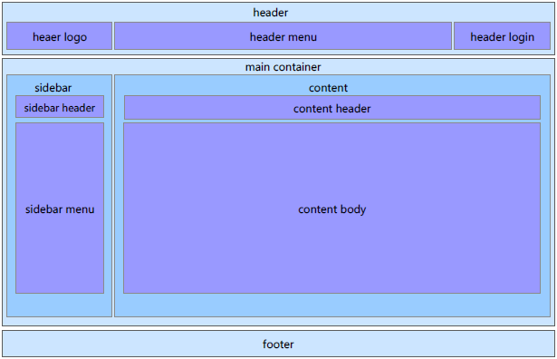
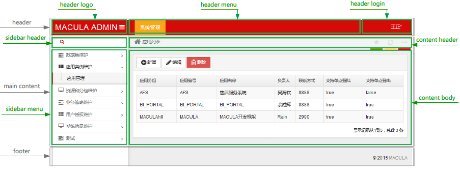

# 展示层

在Macula开发平台下，建议使用Spring MVC + Freemarker的方式来实现展现层。

同时对于Ajax部分，在javascript框架中建议使用jquery框架。

## 页面Layout

Macula 使用 FreeMarker 页面模板技术，下面我们以后台管理页面为例进行讲解。后台管理页面 Layout 结构如下图所示：



由上图可见，Macula 页面 Layout 由 header，main container 和 footer 三部分组成。其中，header 包括 logo，menu，login 组成；main container 主要包括 sidebar 和 content 两大部分；footer 构成比较简单。

为了方便大家理解，我们以一个实际的页面为例子说明各个部分。



页面 Layout 由 Macual 中的 layout_mower.ftl 中的宏定义。开发者可以通过覆盖这个来自定义自己的 header logo，header menu，header login 和footer。要覆盖默认的配置，可以修改自己xi如下这个文件：


## 地址规划

对于当前大部分的业务系统，存在终端使用和后台管理的情况以及未来对于F5在地址分发方面的合理性布局，在地址规划上，需要按一定的规则进行：

* /admin/ ：如果该功能是一个后台管理功能，则需要在地址前端加入/admin/
* /front/：如果该功能是一个用户使用功能，则需要在地址前端加入/front/
* /模块名/：针对macula平台开发的需要，每个模块都必须有自己的地址命名空间，对于该部分的命名，需要在模块定义规划时指定（具体的模块命名可能需要进行流程方面的审批）。
* /功能名称/：针对模块下的某一功能，需要给出功能的名称。
* /操作名称/：针对某一功能下具体的操作，需要给出操作的名称，如index,new,edit,save,read,delete,query等动词。

所以最终的地址命名为：

* 管理功能：/admin/模块名/功能名/操作名称/参数/其他
* 用户功能：/front/模块名/功能名/操作名称/参数/其他


## 请求方式规划

为了保证业务系统不被重复的请求以及不正确的请求干扰，对于请求方式做如下规划：

* 对于获取单条数据或显示新增与编辑页面的方式可以使用GET请求
* 对于删除数据、保存数据或提交多条数据给后台的应该使用POST方式
* 有多个查询条件的查询功能应该使用POST方式

## REST

在对REST的支持方面，使用Spring的REST解决方案，macula平台未做相关变动，这里说明在能使用REST的方式下，尽量使用REST方式。

在Macula平台开发中，将不通过地址中的参数来传递参数值，而直接通过地址信息来传递参数值。

如请求的地址：/admin/macula-uim/user/delete/user1 可通过Controller中定义

```java
@RequestMapping(value = "/admin/macula-uim/user/delete/{userName}", method = RequestMethod.DELETE)

@OpenApi

public ExecuteResponse delete(@PathVariable String userName) {

    //do something

}

```

## REST数据返回格式

为了未来能够将目前的Controller请求方法开放给其他终端使用，有必要对Controller的返回值做一个统一的规划，如下：

```java
public class Response {

	/** 是否成功标识 */
	private boolean success;

	/** 系统级错误代码 */
	private String errorCode;
	/** 系统级错误信息 */
	private String errorMessage;

	/** 业务级错误代码 */
	private String exceptionCode;
	/** 业务级错误信息 */
	private String exceptionMessage;

	/** 异常详细信息 */
	private String exceptionStack;
	/** 服务端重定向信息 */
	private String redirection;

	/** 校验结果信息 */
	private List<FieldError> validateErrors;

	public Response() {
		this.success = true;
	}

	public Response(MaculaException exception) {
		this.success = false;
		this.errorCode = exception.getParentCode();
		this.errorMessage = ApplicationContext.getMessage(errorMessage);
		this.exceptionCode = exception.getMessage();
		this.exceptionMessage = exception.getLocalizedMessage();
		this.exceptionStack = exception.getFullStackMessage();

		if (exception instanceof FormBindException) {
			List<FieldError> fieldErrors = ((FormBindException) exception).getFieldErrors();
			for (FieldError fieldError : fieldErrors) {
				this.addValidateError(fieldError);
			}
		}
	}
}         
```

```java
public class ExecuteResponse<T> extends Response {

	/** 结果信息 */
	private final T returnObject;

	public ExecuteResponse(T result) {
		this.returnObject = result;
	}

	/**
	 * @return the result
	 */
	public T getReturnObject() {
		return returnObject;
	}

}
```

```java
public class PageResponse extends Response {

	/** 本次请求的记录数 */
	private final int size;
	
	/** 当前页码，从零开始 */
	private final int number;
	
	/** 总记录数 */
	private final long totalElements;
	
	/** 总页数 */
	private final int totalPages;
	
	/** 本页的总记录数 */
	private final int numberOfElements;
	
	/** 是否首页 */
	private final boolean firstPage;
	
	/** 是否最后页 */
	private final boolean lastPage;
	
	/** 内容列表 */
	private final List<?> content;

	public PageResponse(Page<?> page) {
		this.size = page.getSize();
		this.number = page.getNumber();
		this.totalElements = page.getTotalElements();
		this.totalPages = page.getTotalPages();
		this.numberOfElements = page.getNumberOfElements();
		this.firstPage = page.isFirstPage();
		this.lastPage = page.isLastPage();
		this.content = page.getContent();
	}
}
```

上述代码中，Response类是基类，出现异常时会构造Response类型返回，ExecuteResponse主要用在单记录数据的返回，PageResponse则用于需要返回列表数据的情况。

***重要***

*为了减少对编程的干扰，正常情况下，Controller中的方法可以仍然按照Service接口中的方法的返回值正常返回数据，对于原使用@ResponseBody注解的方法，如果需要，则通过使用@OpenApi注解来自动处理对应的返回值，默认情况下，采用@OpenApi 注解后，非Response、Map、Model等类型的返回值，会被包裹成ExecuteResponse，而Page<?>返回值会被包裹成PageResponse。*


@OpenApi注解的启用需要配置RequestMappingHandlerAdapter的customReturnValueHandlers属性：

```xml
<property name="customReturnValueHandlers">
    <list>
        <bean class="org.macula.core.mvc.OpenApiReturnValueHandler">
            <constructor-arg ref="messageConverters"/>              
        </bean>
    </list>
</property>
```

## 国际化

国际化 可分为页面国际化和提示信息国际化。

页面国际化可以通过多个Freemarker文件解决，通过不同的国际化后缀来区分不同地区的页面；比如：index.ftl，如果要添加一个英文页面，可以添加index_en_US.ftl，这样当英文国家的用户访问系统时，将最先使用index_en_US.ftl文件。

提示信息国际化使用资源文件处理，在每个模块的资源文件目录下，都有i18n/xxxx/messages_xx_XX.properties等众多资源文件，同时添加到applicationContext-macula.xml配置文件中。

## 表单校验

在Controller中的参数中，使用@FormBean注解来绑定页面数据到Domain，如果转换失败，则失败结果会出现在BindingResult中

在Controller中的参数中，使用@Valid注解来检查页面数据到Domain数据是否符合校验规则，校验规则的定义是在Domain中完成的，采用JSR-303的Bean Validator标准定义。校验失败的结果同样保存在BindingResult中

失败结果可以通过BaseController中的getMergedBindingResults方法得到，具体使用请参考BaseController类的使用说明。

## 使用基类Controller

在展示层编写的Controller实现，需要直接或间接扩展至BaseController

```java
@RequestMapping("admin/macula-base")

public class AdminMaculaBaseController extends BaseController {

    //something

}
```

在BaseController中处理了大量的异常处理方式以及数据返回要求的设定。


## 参数绑定校验

在Spring MVC默认的基础上，Macula开发平台在参数绑定上做了适当扩展，以适应与Struts（Webwork）等相同的对参数处理的一致性，具体来说，有如下的变化：

1. Bean参数绑定
    
    默认情况下，String MVC对参数的绑定方式，采用直接属性名与给定POJO属性名相同的方式实现绑定，为了更好的区分具体的参数信息，Macula平台扩展了这类绑定，允许
    
    ```
    pojo名+ . + 属性名
    ```
    的方式绑定。
    
    **例 8.1. 两种绑定的区别**
    
    比如在Controller中，会返回的用户信息保存，其Controller原型为：
    
    ```java
    public User save(User user){

    // something

    return user;

    }
    ```
    
    此时客户端提交的参数信息为：
    
    ```
    ?userName=Wilson&password=123456
    ```
    
    此时Spring将自动将userName和password绑定生成User对象。但这种方式在返回多个对象时不太适用，所以Macula平台通过扩展，可通过修改Controller中的原型为：
    
    ```java
    public User save(@Valid @FormBean("user") User user){

    if (hasErrors()) {
        throw new FormBindException(getMergedBindingResults());
    }

    // something
    return user;

    }
    ```
    
    通过Macula平台扩展后的提交的数据格式，将可以通过下面提交方式绑定：
    
    ```
    ?user.userName=Wilson&user.password=123456
    ```
    
    为实现这个扩展，主要在于applicationContext-mvc.xml文件中的BeanArgumentResolver定义：
    
    ```xml
    <bean class="org.springframework.web.servlet.mvc.annotation.AnnotationMethodHandlerAdapter">
        <property name="customArgumentResolvers">
            <list>
                <bean class="org.macula.core.mvc.FormBeanArgumentResolver">
                    <property name="webBindingInitializer" ref="webBindingInitializer" />
                </bean>
            </list>
        </property>
    </bean>
    ```
    
    通过对自定义参数的解析，可以实现上述的变化。
    
    ***重要***
    
   *需要注意的是，使用Macula平台的绑定方式的前提是：必须使用@FormBean前缀，并且不能使用诸如@ModelAttribute、@RequestBody等Spring的绑定注解。*
   
2. FormBean的表单防重复提交   

    在Form提交时，为了防止用户对表单的重复提交，除了使用客户端脚本控制按钮的状态外，平台提供了防重复提交的解决方案。

    一般情况下，防重复提交有2个应用场景：1)防止用户无意识的重复提交；2)防止用户恶意的重复提交。
    
    对于无意识的提交，只需要在页面隐藏一个唯一性的Token，在表单提交时返回，在服务端校验并销毁即可完成对Token的验证而阻止该提交。
    
    对于用户可能存在的恶意提交，可通过在表单提交时，插入验证码的方式来进行，用户必须正确输入了验证码，并在服务端校验成功后，才能进行业务逻辑的处理。
    
    在平台实现的方式上，采用在FormBean注解中加入属性：
    
    valid：(boolean)是否需要检测重复提交；
    
    token：(String)在表单页面中提交的参数名称，默认值为ftoken，除非与业务中的字段冲突，否则不需要设置为其他值；
    
    captcha：(boolean)是否检测验证码，来防止恶意提交
    
    整个校验过程由FormBeanArgumentResolver完成。
    
    相应的，在界面层面，需要配合在表单中加入防重复提交信息，在macula.ftl中提供了freemarker宏的默认实现。在该默认实现情况下，可通过在表单位置加入<@macula.formToken />即可，对于需要加入校验码的情况下，使用<@macula.formToken captcha=true />
    
    具体的实现可参考macula.ftl文件。
    
    ***重要***
    
   *主要注意在同一个RequestMapping的方法中，如果有多个通过@FormBean注释的参数，在第一个使用FormBean注释的参数中加入该特性即可，其他不要加。
    特别地，加入了自动控制防重复提交后，生成的客户端token只能进行一次校验即失效，所以在提交后，如果表单需要再次提交，需要更新隐藏的token的值。在默认情况下，调用$(form).trigger('changeCaptcha')即可更新，如果需要定制，可参考macula.ftl中的实现，做自定义的宏来处理。*  
    
3. Pageable参数绑定

    在使用了Spring-Data框架够，对于多数分页式查询，可通过直接传入Pageable参数和额外的参数条件，即可返回包括总记录数、当前页面记录等信息的Page对象返回，对于Controller层，方便的获得页面传递的Pageable参数并构造成相应的对象值，也是一种代码简洁和易用性上的提升。
    
    对于Pageable参数的绑定，比如Controller中编写：
    
    ```java
    @RequestMapping(value = "/test/user/list", method = RequestMethod.GET)

    public Page<User> list(Pageable pageable) {

    Page<User> page = userRespository.findAll(pageable);

    // other coding...

    return page;

    }
    
    ```
    为了实现这个扩展，主要在applicationContext-mvc.xml文件中的PageableArgumentResolver定义：

    ```xml
    <bean class="org.springframework.web.servlet.mvc.annotation.AnnotationMethodHandlerAdapter">

    <property name="messageConverters" ref="messageConverters" />

    <property name="webBindingInitializer" ref="webBindingInitializer" />

    <property name="customArgumentResolvers">

        <list>

            <bean class="org.macula.core.mvc.PageableArgumentResolver" />           

        </list>

    </property>

    </bean>
    ```
    
    Pageable参数绑定时，将直接重Request中获取，如果在一个方法中，需要构建多个Pageable对象，可通过@Qualifier来指定别名，这样在Request中获取属性 别名+ "_" + 属性名，来构建Pageable对象。
    
    ***重要***
    
    *这里Pageable与Bean构建的区别在于，默认情况下Pageable直接从Request中获取数据，而在通过@Qualifier指定别名时，Bean的属性获取规则是 别名+ "." + 属性名，而Pageable的规则是 别名+ "_" +属性名。*

4. 类型转换

    很多情况下，在编辑时或者在查看详细信息时，总是通过传入一个主键值（通常是Long型），来获取具体的记录信息，在Macula平台中，为了简化这种操作，对于已定义的Domain类，可以通过已定义的ConversionService直接转换。

    对应的applicationContext-mvc.xml中配置如下：
    ```xml
    <bean id="conversionService" class="org.springframework.format.support.FormattingConversionServiceFactoryBean">
        <property name="converters">
            <list>
                <bean class="org.macula.core.mvc.RepositoryConverter" />
            </list>
        </property>
    </bean>    
    ```
    
    配置该转化后，需要转化的类型必须实现Persistable接口，并且定义了相对应的JpaRepository，否则也不能正常转换。
    
    ***重要***
    *除了加入该ConversionService外，还需要注意：*
    
    * *普通的VO对象不要实现Persistable接口，即不能使用该转换*
    * *待转化类必须实现Persistable接口*
    * *该带转换Domain对象，在Spring上下文中，已经定义了相应的JpaRepository Bean，用来通过主键载入该对象值*
    
    ***例 8.2. 通过传入主键，直接转化为相应的对象***
    ```java
    @RequestMapping(value = "/test/user/{userId}/edit", method = RequestMethod.GET)
    
    public User edit(@PathVariable("userId") User user) {
    
        return user;
    
    }    
    ```
    
    如上面的Controller中的定义可见，传入的userId是一个字符串（或者可以认为是Long型），但在edit方法中，可直接定义为User user，即由macula平台实现了对主键到相应Domain实例的转换。
    
    当然，这里的User对象实现了Persistable接口，并已有相应的UserRepository extends `JpaRepository<User>`的实现。


## ExcelView

为了更好的支持Excel的导出功能，系统提供了ExcelView类结合ExcelUtils的Excel模板方式导出Excel。只要按照ExcelUtils的语法制作Excel模板，然后放在FreeMarker模板文件放置的目录中，在Controller中如下使用：

```java
public ModelAndView excel2() {
	Map<String, Object> model = new HashMap<String, Object>();
	model.put("name", "变量");
	return new ModelAndView(new ExcelView(getRelativePath("/so_master/excel")), model);                   
}
```

上述代码将会去views/admin[front]/xxxx/so_master/目录下寻找excel.xls的Excel模板文件，然后通过ExcelUtils解析该模板文件生成需要的Excel文件。
    


